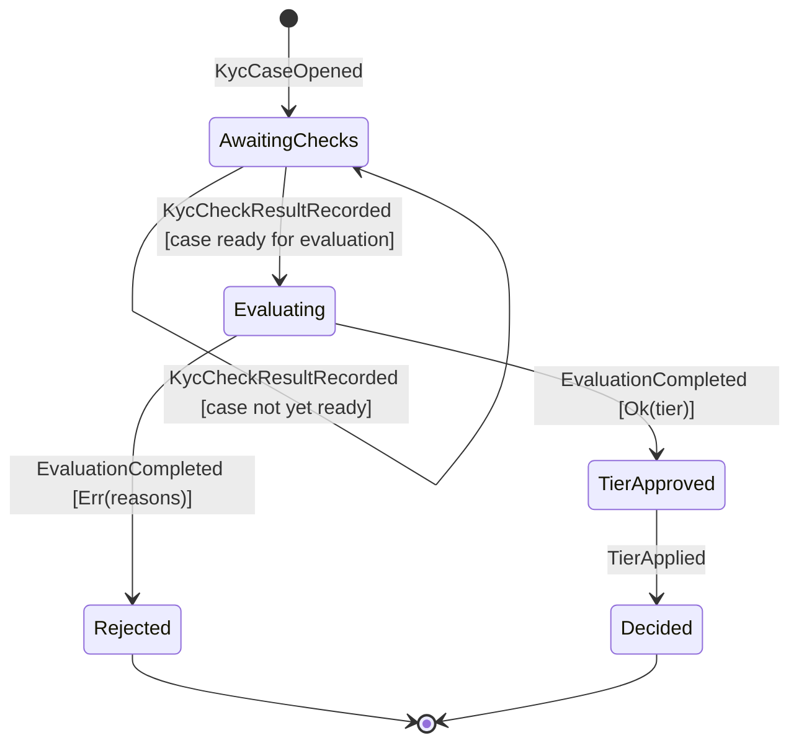
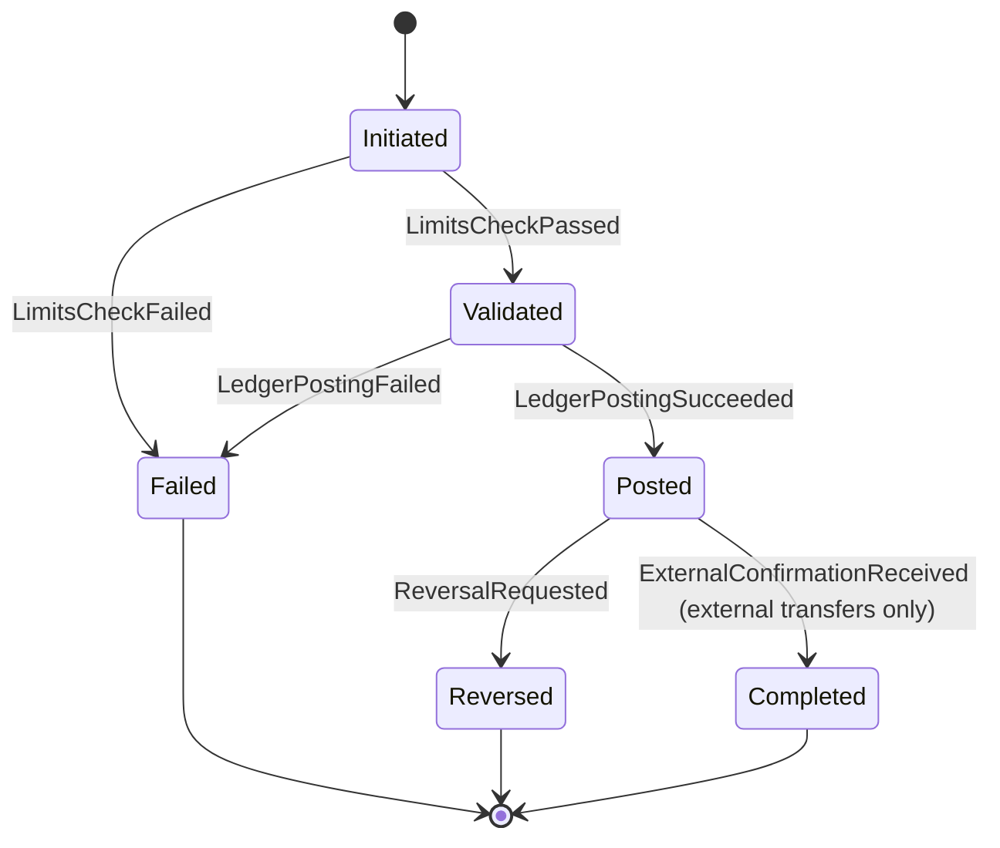
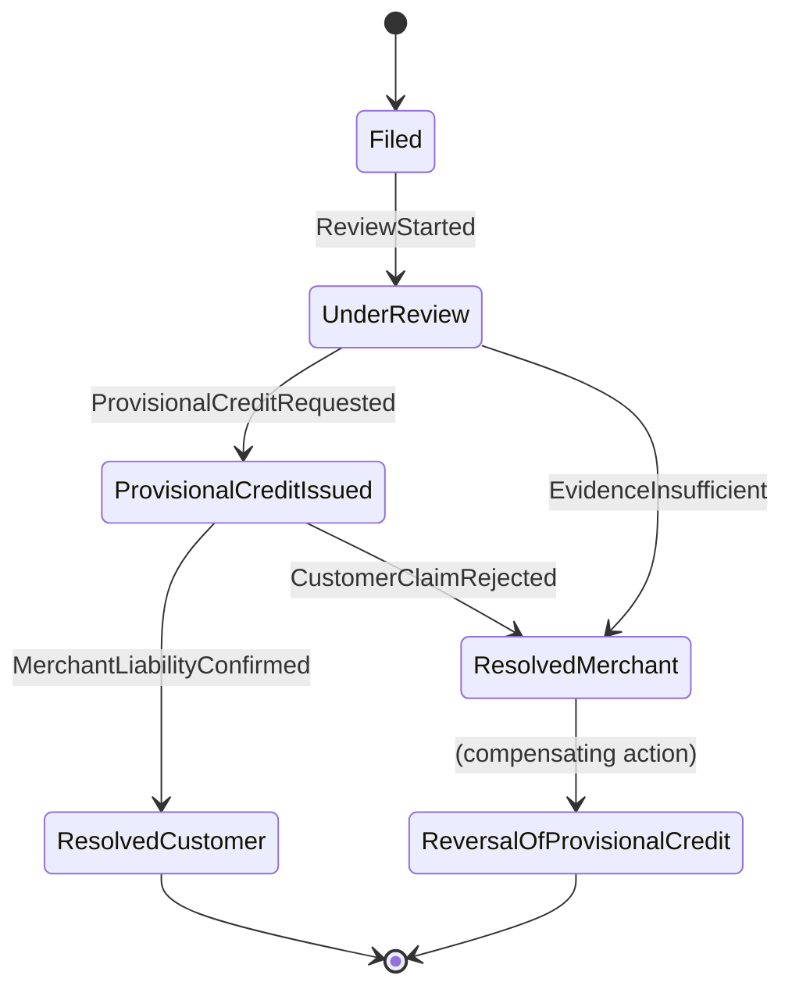

# AtlasPay — Design Reference

> Living architecture/design document. Structure only — no method bodies, no business
> logic. Update in place as the design evolves.

## Conventions

- **Java 21**, multi-module Gradle: `atlaspay-core`, `atlaspay-persistence`,
  `atlaspay-messaging`, `atlaspay-simulators`, `atlaspay-api`, `atlaspay-app`.
- `atlaspay-core` is **framework-free**: no Spring, no JPA, no Jackson annotations.
  It contains aggregates, entities, value objects, domain events, domain services,
  repository *interfaces*, and saga/process-manager skeletons.
- Package-by-feature inside `atlaspay-core` (e.g. `core.identity`, `core.accounts`,
  `core.ledger`, `core.transfers`, `core.cards`, `core.limits`, `core.access`), not
  by technical layer.
- Hexagonal architecture: `core` defines ports (interfaces); `persistence`,
  `messaging`, `simulators`, `api` are adapters plugged in at `atlaspay-app` wiring
  time (wiring itself is out of scope for this document).
- EIP references are to Hohpe & Woolf, *Enterprise Integration Patterns*. DDD
  references are to Evans, *Domain-Driven Design*.

## Shared kernel (`core.shared`)

```java
public interface DomainEvent {
    UUID eventId();          // unique event identifier
    Instant occurredOn();    // event timestamp
}
```
*Marker + minimal contract every domain event implements — supports uniform event
publishing/outbox serialization without coupling core to a messaging framework.*

```java
public interface Repository<T, ID> {
    Optional<T> findById(ID id);   // load by identity
    T save(T aggregate);           // persist new or updated aggregate state; throws an OptimisticLockException-style failure on version conflict
    Page<T> findAll(int pageNumber, int pageSize); // paginated listing, e.g. for admin screens
}
```
*Generic repository port (DDD: Repository pattern). Lives in core; implementations
live in `atlaspay-persistence` — see Dependency Inversion note under each domain's
Repository section. `save` is the enforcement point for the optimistic-locking
strategy declared on `AggregateRoot.version` — the adapter compares versions
inside the same transaction as the write. `findAll` is the intended consumer of
the `Page<T>` value object declared above, so that generic type has a concrete
use rather than sitting unused.*

```java
public sealed interface Result<T, E> permits Result.Ok, Result.Err {
    record Ok<T, E>(T value) implements Result<T, E> {}
    record Err<T, E>(E error) implements Result<T, E> {}

    boolean isOk();                     // true if this is a success result
    T orElseThrow();                    // unwrap value or throw if error
}
```
*Generic `Result<T, E>` for validation/business-rule outcomes that are expected
failures (not exceptions) — e.g. KYC rule evaluation, limit checks. Avoids
exceptions-as-control-flow for expected domain outcomes.*

```java
public record Page<T>(List<T> content, int pageNumber, int pageSize, long totalElements) {
}
```
*Generic paginated read wrapper returned by repository/query methods that list
aggregates (e.g. `findByCompanyId` paged variants).*

```java
public interface Specification<T> {
    boolean isSatisfiedBy(T candidate);         // true if candidate meets the rule
    Specification<T> and(Specification<T> other); // combinator: logical AND
    Specification<T> or(Specification<T> other);  // combinator: logical OR
}
```
*Generic Specification pattern (Evans) — backbone of the pluggable `KycRuleEngine`
and reusable for `LimitPolicy` rule composition.*

```java
public abstract class AggregateRoot<ID> {
    private final ID id;                             // identity; set exactly once, at construction, never reassigned
    private final List<DomainEvent> pendingEvents; // uncommitted events raised by this aggregate
    private long version;                            // optimistic-lock token; incremented by the persistence adapter on each successful save

    protected AggregateRoot(ID id);                  // every subclass constructor must supply identity immediately via super(id) — no aggregate can exist without one
    public ID id();                                   // single accessor every aggregate gets for free — consumed by Repository<T, ID> callers, OutboxRelay (populating aggregateId), and any other polymorphic code that needs an aggregate's identity without knowing its concrete type
    protected void register(DomainEvent event);     // records an event to be published on save
    public List<DomainEvent> pullEvents();          // drains and returns pending events
    public long version();                            // exposes the current version for optimistic-lock comparison
}
```
*Base type applying the DDD Aggregate Root pattern's event-recording responsibility
uniformly; concrete aggregates extend this instead of re-implementing event buffers.
`id` moved here — previously every concrete aggregate hand-declared its own `id`
field, which meant nothing could reference "an aggregate's identity" without
already knowing its concrete type; `Repository<T, ID>`, `OutboxRelay`, and
polymorphic event-publishing code all implicitly needed exactly this. Declaring it
once, `private` and `final`, set only through the constructor, is the strongest
Java encapsulation available: no subclass can reassign it after construction, and
no subclass needs to re-declare or re-validate it. **Concurrency safety**:
`version` lives here for the same reason — every mutable aggregate gets optimistic
locking "for free" via inheritance (a single point of enforcement, no risk of a
concrete aggregate forgetting it). In a financial system a lost update (e.g. two
concurrent `Account.freeze()` calls) is unacceptable, so every `save()` in
`atlaspay-persistence` must compare the incoming version against the stored
version and fail the write on mismatch. `id` and `version` are deliberately
different kinds of state and don't interact: `id` is permanent identity (Evans:
what makes an Aggregate Root a Root), `version` is a mutable, adapter-owned
concurrency token — conflating them (e.g. treating a version bump as identity
change) would break both the Repository contract and equality semantics.
`JournalEntry` inherits `version` too but never needs it in practice — it has no
mutation methods after construction, so no concurrent-update path exists to
protect against; the field simply stays `0`, which is harmless rather than
requiring a special case in the base type.*

---

## 1. Identity & Onboarding

### Aggregates & Entities

```java
public final class Company extends AggregateRoot<CompanyId> {
    private CompanyName name;                    // legal name VO
    private RegistrationNumber registrationNumber; // business registration VO
    private CompanyStatus status;                 // PENDING, VERIFIED, SUSPENDED
    private final Instant onboardedAt;

    public Company(CompanyId id, CompanyName name, RegistrationNumber registrationNumber); // enforces required fields; invariant enforcement; raises CompanyRegistered
    public void verify(VerificationDecision decision);       // transitions PENDING -> VERIFIED; raises CompanyVerified
    public void suspend(String reason);                       // transitions -> SUSPENDED; raises CompanySuspended
    public CompanyStatus status();                            // accessor
}
```
*Aggregate Root — invariant: cannot transition to VERIFIED without a passing
`VerificationDecision`; enforced inside `verify`, not by callers.*

```java
public final class Customer extends AggregateRoot<CustomerId> {
    private final CompanyId companyId;             // owning company (aggregate reference by ID only)
    private PersonalDetails personalDetails;        // name/DOB/address VO
    private KycTier kycTier;                        // current tier
    private KycStatus kycStatus;                     // NOT_STARTED, IN_REVIEW, APPROVED, REJECTED

    public Customer(CustomerId id, CompanyId companyId, PersonalDetails personalDetails); // invariant enforcement: valid personal details required; raises CustomerOnboarded
    public void applyKycTier(KycTier newTier);           // raises CustomerKycTierChanged; invariant: tier changes only from APPROVED status
    public void recordKycDecision(KycDecision decision); // updates kycStatus; raises CustomerKycDecided
    public KycTier kycTier();                             // accessor
}
```
*Aggregate Root referencing `Company` by identity only (`CompanyId`), per DDD
aggregate boundary rules — avoids loading the whole company graph to mutate a
customer.*

```java
public final class KycCase extends AggregateRoot<KycCaseId> {
    private final CustomerId customerId;
    private final List<KycCheckResult> checkResults; // private, exposed only via unmodifiable view
    private KycStatus status;

    public KycCase(KycCaseId id, CustomerId customerId);   // invariant enforcement; raises KycCaseOpened
    public void recordCheckResult(KycCheckResult result);   // appends result; recalculates status; raises KycCheckResultRecorded
    public List<KycCheckResult> checkResults();              // returns unmodifiable copy
}
```
*Resolved as its own **Aggregate Root**, not an Entity of `Customer` (this
document previously left the boundary open). DDD draws aggregate boundaries
around true transactional consistency requirements, not object containment:
individual `KycCheckResult`s arrive asynchronously and independently — from
document checks, sanction-list screening, address verification, etc. — often
minutes or hours apart, and none of that churn needs to be transactionally
consistent with `Customer`. Making `KycCase` its own root means each check-result
write takes its own optimistic-lock version and never contends with, or blocks,
unrelated writes to the `Customer` aggregate. `Customer` only needs to be
*eventually* consistent with the case's outcome, which is exactly what the
`CustomerKycDecided` domain event (published once the case concludes) provides —
consistent with `KycCaseRepository` already being modeled as a first-class
repository in this document.*

### Value Objects

- `CompanyId`, `CustomerId`, `KycCaseId` — wrap `UUID`; value-equality by wrapped id.
- `CompanyName(String value)` — non-blank invariant enforced in constructor.
- `RegistrationNumber(String value)` — format-validated in constructor.
- `PersonalDetails(String fullName, LocalDate dateOfBirth, Address address)` — compared by all fields.
- `Address(String line1, String line2, String city, String postalCode, String countryCode)`.
- `KycTier` — enum `TIER_0, TIER_1, TIER_2, TIER_3` (increasing verification depth, ties to Limits domain).
- `VerificationDecision(boolean approved, String reviewer, Instant decidedAt)`.
- `KycDecision(KycStatus outcome, String reviewer, String notes)`.
- `KycCheckResult(String checkName, boolean passed, String detail)`.

*All value objects: immutable (`final` fields, no setters), `equals`/`hashCode`
over all fields, no identity field — per DDD Value Object pattern.*

### Domain Events

```java
public record CompanyRegistered(UUID eventId, Instant occurredOn, CompanyId companyId, CompanyName name) implements DomainEvent {}
public record CompanyVerified(UUID eventId, Instant occurredOn, CompanyId companyId) implements DomainEvent {}
public record CompanySuspended(UUID eventId, Instant occurredOn, CompanyId companyId, String reason) implements DomainEvent {}
public record CustomerOnboarded(UUID eventId, Instant occurredOn, CustomerId customerId, CompanyId companyId) implements DomainEvent {}
public record CustomerKycTierChanged(UUID eventId, Instant occurredOn, CustomerId customerId, KycTier oldTier, KycTier newTier) implements DomainEvent {}
public record CustomerKycDecided(UUID eventId, Instant occurredOn, CustomerId customerId, KycStatus status) implements DomainEvent {}
public record KycCaseOpened(UUID eventId, Instant occurredOn, KycCaseId kycCaseId, CustomerId customerId) implements DomainEvent {}
public record KycCheckResultRecorded(UUID eventId, Instant occurredOn, KycCaseId kycCaseId, String checkName, boolean passed) implements DomainEvent {}
```

### Repository Interfaces

```java
public interface CompanyRepository extends Repository<Company, CompanyId> {
    Optional<Company> findByRegistrationNumber(RegistrationNumber number); // lookup for onboarding dedup
}

public interface CustomerRepository extends Repository<Customer, CustomerId> {
    List<Customer> findByCompanyId(CompanyId companyId); // list customers under a company
}

public interface KycCaseRepository extends Repository<KycCase, KycCaseId> {
    Optional<KycCase> findActiveByCustomerId(CustomerId customerId); // find in-flight case
}

public interface KycEvaluationSagaRepository extends Repository<KycEvaluationSaga, KycCaseId> {
}
```
*Same rationale as `TransferSagaRepository`/`ChargebackSagaRepository` in the
Transfers and Cards domains: the process manager's state must be durably and
safely resumable across restarts and concurrent event delivery.*
*Interfaces live in `core.identity` (Dependency Inversion — the domain defines the
contract it needs); JPA-backed implementations live in `atlaspay-persistence`, so
core never depends on JPA/Hibernate types.*

### Domain Services

```java
public interface KycRuleEngine {
    Result<KycTier, List<String>> evaluate(Customer customer, KycCase kycCase); // determines eligible tier or validation failures; invoked by KycEvaluationSaga once a case has enough recorded checks — never called directly by a controller or another domain
}

public interface KycRule extends Specification<KycCase> {
    String ruleName(); // identifies the rule for audit/reporting
}
```
*`KycRuleEngine` composes pluggable `KycRule` specifications (Specification
pattern) so new compliance rules can be added without modifying the engine —
Open/Closed Principle applied to a domain service.*

### Saga / Process Manager



```java
public final class KycEvaluationSaga extends AggregateRoot<KycCaseId> {
    private final CustomerId customerId;      // the Customer this case's outcome will ultimately be applied to
    private KycEvaluationSagaState state;       // current process-manager state

    public void onKycCaseOpened(KycCaseOpened event);                                // starts the saga in AwaitingChecks
    public void onKycCheckResultRecorded(KycCheckResultRecorded event);               // re-evaluates readiness; stays in AwaitingChecks, or transitions to Evaluating and invokes KycRuleEngine.evaluate
    public void onEvaluationCompleted(Result<KycTier, List<String>> result);          // Ok(tier): calls Customer.recordKycDecision(APPROVED), then Customer.applyKycTier(tier); Err(reasons): calls Customer.recordKycDecision(REJECTED) — compensating outcome, no tier change
}
```
*EIP **Process Manager**, following the same shape as `TransferSaga` and
`ChargebackSaga`: `KycCheckResult`s arrive asynchronously and independently (see
the `KycCase` aggregate-boundary rationale above), so something has to own
deciding *when* enough of them have accumulated to run `KycRuleEngine.evaluate`
and then drive the result back onto a different aggregate (`Customer`) —
exactly the cross-aggregate sequencing responsibility a Process Manager exists
for. The state machine is intentionally **not** a copy of `TransferSaga`'s
binary pass/fail shape: `KycRuleEngine.evaluate` returns `Result<KycTier, ...>`,
not `Result<Void, ...>`, because `KycTier` has four levels rather than a single
gate — an `Ok` result names *which* tier the customer qualifies for, it isn't a
simple yes/no. `Err` is reserved for an outright compliance failure (e.g. a
sanctions-list hit), not merely "not enough evidence yet" — the latter is
handled entirely within `AwaitingChecks` by not invoking the engine until the
case is ready, so the engine is only ever asked a question it can actually
answer. The `TierApproved -> Decided` split (rather than one combined step)
exists because of `Customer`'s own documented invariant — `applyKycTier` may
only run once status is `APPROVED` — so the saga must call
`recordKycDecision(APPROVED)` before `applyKycTier(tier)`, never the reverse;
collapsing them into one call would make that ordering invisible. Extends
`AggregateRoot<KycCaseId>` for the same optimistic-locking reason as the other
two sagas: concurrent/duplicate delivery of `KycCheckResultRecorded` events must
not silently lose a transition.*

---

## 2. Accounts

### Aggregates & Entities

```java
public final class Account extends AggregateRoot<AccountId> {
    private final AccountNumber accountNumber;    // externally visible VO
    private final CustomerId ownerId;               // owning customer reference by ID
    private AccountType type;                       // WALLET, SETTLEMENT, etc.
    private AccountStatus status;                    // ACTIVE, FROZEN, CLOSED

    public Account(AccountId id, AccountNumber accountNumber, CustomerId ownerId, AccountType type); // invariant enforcement; raises AccountOpened
    public void freeze(String reason);          // ACTIVE -> FROZEN; raises AccountFrozen
    public void close(AccountClosurePermit permit); // -> CLOSED; raises AccountClosed; rejects (no-op / throws) if permit.accountId() does not match this account's id — see AccountClosurePermit below
    public AccountStatus status();                // accessor
}
```
*Aggregate Root. Deliberately holds **no balance field** — balance is a derived
read, never stored state, to keep the ledger the single source of truth (see
Domain Services below).*

### Value Objects

- `AccountId` — wraps `UUID`.
- `AccountNumber(String value)` — fixed-format identifier, checksum-validated in constructor; compared by value.
- `AccountType` — enum `WALLET, SETTLEMENT, FEE_COLLECTION, DISPUTE_HOLDING`.
- `AccountStatus` — enum `ACTIVE, FROZEN, CLOSED`.
- `Balance(Money amount, Instant asOf)` — a **derived, transient** VO returned by queries, never persisted against `Account` itself.

```java
public final class AccountClosurePermit {
    private final AccountId accountId;   // the specific account this permit was evaluated for
    private final Instant issuedAt;        // when the zero-balance check was performed

    AccountClosurePermit(AccountId accountId, Instant issuedAt); // package-private constructor: only code inside core.accounts (i.e. AccountClosureService's implementation) can create one
    AccountId accountId();                                          // package-private accessor; used by Account.close() to verify the permit was issued for this account, not a different one
}
```
*This is the structural fix for the `Account.close()` invariant: a package-private
constructor makes `AccountClosurePermit` **unforgeable** by anything outside the
`core.accounts` package — no API controller, no other domain, no test double
sitting outside the package can call `new AccountClosurePermit(...)` directly.
The only way to obtain a real instance is to call `AccountClosureService.canClose`
and receive its `Ok` result. `Account.close(permit)` (see below) additionally
checks `permit.accountId().equals(this.id())`, so a permit legitimately obtained
for one account can't be replayed against a different one. This turns the
zero-balance precondition from something merely *documented* into something the
Java type system makes impossible to bypass — closing the gap the previous
version of this document left open.*

### Domain Events

```java
public record AccountOpened(UUID eventId, Instant occurredOn, AccountId accountId, CustomerId ownerId) implements DomainEvent {}
public record AccountFrozen(UUID eventId, Instant occurredOn, AccountId accountId, String reason) implements DomainEvent {}
public record AccountClosed(UUID eventId, Instant occurredOn, AccountId accountId) implements DomainEvent {}
```

### Repository Interfaces

```java
public interface AccountRepository extends Repository<Account, AccountId> {
    List<Account> findByCompanyId(CompanyId companyId);   // accounts under a company (via customer join at adapter level)
    Optional<Account> findByAccountNumber(AccountNumber number); // lookup for transfers
}
```
*Kept framework-free in core; the `atlaspay-persistence` implementation performs
the actual join across `Customer`/`Company` using JPA, hidden behind this
interface — core never expresses SQL/JPQL concerns.*

### Domain Services

```java
public interface BalanceCalculator {
    Balance currentBalance(AccountId accountId);                 // sums posted ledger lines
    Balance balanceAsOf(AccountId accountId, Instant pointInTime); // historical balance query
}
```
*Stateless domain service — balance is *computed*, not stored, enforcing the
Ledger domain as sole source of financial truth (avoids dual-write inconsistency
between an `Account.balance` field and ledger entries). Internally delegates the
actual summation to `LedgerAggregationService` (see Ledger domain) rather than
querying `JournalEntryRepository` itself — see the Duplicate Ownership note there.*

```java
public interface AccountClosureService {
    Result<AccountClosurePermit, String> canClose(Account account); // evaluates the zero-balance precondition via BalanceCalculator; the Ok case is the only way to obtain a permit that Account.close() will accept
}
```
*This is a genuine **cross-aggregate invariant**, not a misplaced one: whether an
`Account` may close depends on `JournalEntry` state that belongs to a different
aggregate entirely, so `Account` structurally cannot check it itself without
reaching outside its own boundary (which would violate its own encapsulation and
transactional consistency scope). DDD's guidance here is that such rules belong
in a domain service that depends on both aggregates' ports, not inside either
aggregate. Returning `Result<AccountClosurePermit, String>` rather than
`Result<Void, String>` is what makes the previous version of this rule
enforceable rather than just advisory — see `AccountClosurePermit` under Value
Objects above and `Account.close(permit)` above: the permit is the only thing
`close()` accepts, and the only way to legitimately obtain one is through this
service.*

---

## 3. Ledger

### Aggregates & Entities

```java
public final class JournalEntry extends AggregateRoot<JournalEntryId> {
    private final Instant postedAt;                  // append-only: immutable once constructed
    private final TransactionReference reference;     // correlates to originating transfer/payment
    private final List<LedgerLine> lines;               // unmodifiable, at least 2 lines

    public JournalEntry(JournalEntryId id, TransactionReference reference, List<LedgerLine> lines); // invariant enforcement: lines must balance to zero (double-entry) and list.size() >= 2; raises JournalEntryPosted
    public List<LedgerLine> lines();                    // returns unmodifiable view
    public boolean isBalanced();                          // verifies sum(debits) == sum(credits)
}
```
*Aggregate Root. **Append-only and immutable** — no setters, no mutation methods
at all after construction; the constructor is the sole invariant-enforcement
point (double-entry balance rule), consistent with the ledger being a
write-once audit trail (Evans: Aggregate invariants enforced at construction).*

### Value Objects

- `Money` — see full signature and rationale immediately below (expanded from a
  plain two-field record because monetary arithmetic has correctness rules that
  must be structurally enforced, not left to callers).
- `LedgerLine(AccountId accountId, Money amount, EntryDirection direction)` — `EntryDirection` enum `DEBIT, CREDIT`; immutable.
- `JournalEntryId`, `TransactionReference` — identifier VOs wrapping `UUID`/`String`.

```java
public final class Money implements Comparable<Money> {
    private final BigDecimal amount;   // always rescaled to currency.getDefaultFractionDigits()
    private final Currency currency;

    public Money(BigDecimal amount, Currency currency);          // invariant enforcement: rejects null, rescales to the currency's minor-unit precision using RoundingMode.HALF_EVEN
    public static Money zero(Currency currency);                   // identity element for a given currency, useful as a fold/reduce seed
    public static Money ofMinorUnits(long minorUnits, Currency currency); // constructs from integer minor units (e.g. cents) — preferred entry point from API/adapter layers, avoids floating-point input entirely
    public Money add(Money other);                                  // returns new Money; throws CurrencyMismatchException if currencies differ
    public Money subtract(Money other);                               // returns new Money; throws CurrencyMismatchException if currencies differ
    public Money negate();                                              // returns new Money with sign flipped
    public Money multiply(BigDecimal factor, RoundingMode roundingMode); // scalar multiply (e.g. a fee percentage) with an explicit, caller-chosen rounding mode — no implicit default
    public List<Money> allocate(int parts);                              // splits into `parts` shares that sum back exactly to the original (largest-remainder method), avoiding the classic "rounding leaves a cent unaccounted for" bug
    public boolean isNegative();                                          // sign check
    public boolean isZero();                                               // zero check
    public int compareTo(Money other);                                     // throws CurrencyMismatchException if currencies differ; enables ordering/min/max in limit checks
}
```
*`Money` is deliberately **not** a bare record: accounting requires (a) a fixed
decimal scale per currency rather than an arbitrary `BigDecimal` scale — the
constructor rescales rather than trusting the caller; (b) an explicit, caller-
chosen `RoundingMode` on any operation that can produce a non-representable
fraction, so rounding behavior is never a silent default; (c) no `double`/`float`
entry point anywhere, since binary floating point cannot represent currency minor
units exactly; and (d) no silent cross-currency arithmetic — mismatches throw
rather than coercing. `allocate` exists because double-entry postings that split
an amount (e.g. a fee split across parties) must sum back to the original amount
exactly, which naive per-share rounding does not guarantee. `LedgerLine` and
`Money` remain the canonical Value Objects here: no identity, compared purely by
field values, freely shared/copied — `Money`'s extra surface area is about
correctness invariants, not identity.*

### Domain Events

```java
public record JournalEntryPosted(UUID eventId, Instant occurredOn, JournalEntryId entryId, TransactionReference reference) implements DomainEvent {}
```

### Repository Interfaces

```java
public interface JournalEntryRepository extends Repository<JournalEntry, JournalEntryId> {
    List<JournalEntry> findByAccountId(AccountId accountId);                       // all entries touching an account
    List<JournalEntry> findByAccountId(AccountId accountId, Instant from, Instant to); // windowed read, used by Limits domain
}
```
*Append-only aggregate ⇒ repository intentionally has **no delete/update-style
methods** at the interface level — the contract itself communicates the
immutability invariant to any adapter implementing it.*

### Domain Services

```java
public interface LedgerPostingService {
    JournalEntry post(TransactionReference reference, List<LedgerLine> lines); // constructs & persists a balanced JournalEntry
}
```
*Thin domain service wrapping construction + repository save, giving other
domains (Transfers, Cards) a single entry point instead of constructing
`JournalEntry` directly.*

```java
public interface LedgerAggregationService {
    Money sumLines(AccountId accountId, Instant from, Instant to); // net of all DEBIT/CREDIT lines for the account within [from, to)
}
```
*Single owner of "sum ledger lines over a window" — previously this arithmetic was
implicitly duplicated between Accounts' `BalanceCalculator` (unbounded window) and
Limits' `RollingWindowLimitChecker` (bounded window). Both now delegate here
instead of each querying `JournalEntryRepository` and summing independently, per
the Single Responsibility Principle: only the Ledger domain decides how ledger
lines are aggregated into a monetary total.*

---

## 4. Transfers

### Aggregates & Entities

```java
public sealed abstract class Transfer extends AggregateRoot<TransferId>
        permits InternalTransfer, InboundExternalTransfer, OutboundExternalTransfer {
    protected final Money amount;
    protected TransferStatus status;             // INITIATED, POSTED, FAILED, REVERSED

    protected Transfer(TransferId id, Money amount); // invariant enforcement: amount must be positive; raises TransferInitiated
    public TransferStatus status();                    // accessor
    public abstract void markPosted(JournalEntryId entryId); // records successful ledger posting; raises TransferPosted
    public abstract void markFailed(String reason);          // records failure; raises TransferFailed
}

public final class InternalTransfer extends Transfer {
    private final AccountId sourceAccountId;
    private final AccountId destinationAccountId; // invariant: source != destination, enforced in constructor
    // constructor + accessors omitted for brevity — see implementation
}

public final class InboundExternalTransfer extends Transfer {
    private final AccountId destinationAccountId;
    private final ExternalPartyReference originatingParty; // e.g. simulated bank reference
}

public final class OutboundExternalTransfer extends Transfer {
    private final AccountId sourceAccountId;
    private final ExternalPartyReference beneficiaryParty;
}
```
*Aggregate Root hierarchy (sealed) modeling three distinct transfer flows as
subtypes rather than a single flags-heavy class — each subtype enforces its own
invariants (e.g. `sourceAccountId != destinationAccountId`) in its constructor.*

### Value Objects

- `TransferId` — wraps `UUID`.
- `ExternalPartyReference(String partyId, String partyName)` — identifies a simulated external counterparty; compared by value.
- `TransferStatus` — enum `INITIATED, POSTED, FAILED, REVERSED`.

### Domain Events

```java
public record TransferInitiated(UUID eventId, Instant occurredOn, TransferId transferId, Money amount) implements DomainEvent {}
public record TransferPosted(UUID eventId, Instant occurredOn, TransferId transferId, JournalEntryId entryId) implements DomainEvent {}
public record TransferFailed(UUID eventId, Instant occurredOn, TransferId transferId, String reason) implements DomainEvent {}
public record TransferReversed(UUID eventId, Instant occurredOn, TransferId transferId, JournalEntryId compensatingEntryId) implements DomainEvent {}
```

### Repository Interfaces

```java
public interface TransferRepository extends Repository<Transfer, TransferId> {
    List<Transfer> findByAccountId(AccountId accountId); // history for either side of a transfer
}

public interface TransferSagaRepository extends Repository<TransferSaga, TransferId> {
}
```
*A Process Manager's state (`TransferSaga`) is itself durable, mutable state that
must survive process restarts and be safely resumed across concurrent event
deliveries — so it gets a repository and inherits `AggregateRoot`'s optimistic
lock exactly like a domain aggregate, even though conceptually it is
orchestration rather than domain state (EIP: Process Manager instances require
persistent, versioned storage, same as the aggregates they coordinate).*

### Domain Services

```java
public interface TransferValidationService {
    Result<Void, List<String>> validate(Transfer transfer); // pre-posting checks before saga proceeds: account-status checks + delegates limit checks to LimitEvaluationService
}
```
*Composes two genuinely cross-aggregate checks into one domain service call: (1)
that both accounts involved are `ACTIVE` (reads `Account`, which `Transfer` itself
must not reach into — correct placement per DDD aggregate boundary rules), and
(2) the applicable spending limits, delegated to Limits' single
`LimitEvaluationService` rather than calling `LimitPolicy`/`RollingWindowLimitChecker`
directly — see the Duplicate Ownership note in the Limits domain.
`CardPaymentAuthorizationService` delegates to that same `LimitEvaluationService`
for its own limit checks, so limit logic has exactly one owner across both
domains.*

### Saga / Process Manager



```java
public final class TransferSaga extends AggregateRoot<TransferId> {
    private TransferSagaState state;         // current process-manager state

    public void onTransferInitiated(TransferInitiated event);            // starts saga, requests limits check
    public void onLimitsCheckResult(Result<Void, List<String>> result);   // proceeds to posting or triggers compensating failure; raises LimitBreached on failure
    public void onLedgerPostingSucceeded(JournalEntryId entryId);          // transitions to Posted
    public void onLedgerPostingFailed(String reason);                       // compensating action: mark Transfer failed
    public void onExternalConfirmationReceived(ExternalPartyReference ref);  // completes external transfer flow
    public void onReversalRequested(String reason);                          // triggers compensating ledger entry
}
```
*EIP **Process Manager** pattern: the saga centralizes routing/sequencing logic
across Limits, Ledger, and (for external transfers) Simulator interactions,
so no single aggregate needs to know about the others. Compensating actions
(`onLedgerPostingFailed`, `onReversalRequested`) implement the Saga pattern's
rollback semantics instead of distributed transactions. Extending `AggregateRoot`
gives the saga the same optimistic-lock `version` field as domain aggregates —
without it, two concurrently-delivered events for the same transfer (e.g. a
duplicate Kafka redelivery racing a legitimate next-step event) could
read-modify-write the saga's state and silently lose one transition. Ownership of
`LimitBreached` is resolved here: the domain service
(`RollingWindowLimitChecker`/`LimitEvaluationService`) only returns a `Result`; it
is the saga — the thing that receives that `Result` and decides what happens
next — that publishes the event, since publishing a business event on failure is
a process/orchestration decision, not a pure query result.*

---

## 5. Cards

### Aggregates & Entities

```java
public final class Card extends AggregateRoot<CardId> {
    private final CardToken token;                  // tokenized PAN surrogate, never raw PAN
    private final AccountId linkedAccountId;
    private CardStatus status;                        // ISSUED, ACTIVE, BLOCKED, EXPIRED
    private final YearMonth expiry;

    public Card(CardId id, CardToken token, AccountId linkedAccountId, YearMonth expiry); // invariant enforcement: expiry must be in the future; raises CardIssued
    public void activate();                       // ISSUED -> ACTIVE; raises CardActivated
    public void block(String reason);               // -> BLOCKED; raises CardBlocked
    public CardStatus status();                       // accessor
}
```
*Aggregate Root. Never stores raw PAN — only a `CardToken` value object,
demonstrating a security invariant enforced structurally rather than by
validation logic.*

```java
public final class Dispute extends AggregateRoot<DisputeId> {
    private final CardId cardId;
    private final TransferId originatingTransferId;
    private ReasonCode reasonCode;
    private DisputeStatus status;                 // FILED, UNDER_REVIEW, RESOLVED_MERCHANT, RESOLVED_CUSTOMER

    public Dispute(DisputeId id, CardId cardId, TransferId originatingTransferId, ReasonCode reasonCode); // invariant enforcement; raises DisputeFiled
    public void resolve(DisputeResolution resolution);  // transitions to a RESOLVED_* status; raises DisputeResolved
    public DisputeStatus status();                        // accessor
}
```
*Aggregate Root, separate from `Card`, because disputes have independent
lifecycle/concurrency needs (DDD: aggregate boundaries drawn around consistency
requirements, not just object containment).*

### Value Objects

- `CardId`, `DisputeId` — wrap `UUID`.
- `CardToken(String value)` — opaque tokenized reference; compared by value.
- `CardStatus` — enum `ISSUED, ACTIVE, BLOCKED, EXPIRED`.
- `ReasonCode(String code, String description)` — chargeback/dispute reason taxonomy entry.
- `DisputeResolution(DisputeStatus outcome, Money adjustedAmount, String notes)`.

### Domain Events

```java
public record CardIssued(UUID eventId, Instant occurredOn, CardId cardId, AccountId linkedAccountId) implements DomainEvent {}
public record CardActivated(UUID eventId, Instant occurredOn, CardId cardId) implements DomainEvent {}
public record CardBlocked(UUID eventId, Instant occurredOn, CardId cardId, String reason) implements DomainEvent {}
public record DisputeFiled(UUID eventId, Instant occurredOn, DisputeId disputeId, ReasonCode reasonCode) implements DomainEvent {}
public record DisputeResolved(UUID eventId, Instant occurredOn, DisputeId disputeId, DisputeStatus outcome) implements DomainEvent {}
```

### Repository Interfaces

```java
public interface CardRepository extends Repository<Card, CardId> {
    List<Card> findByAccountId(AccountId accountId); // cards linked to an account
}

public interface DisputeRepository extends Repository<Dispute, DisputeId> {
    List<Dispute> findByCardId(CardId cardId); // dispute history for a card
}

public interface ChargebackSagaRepository extends Repository<ChargebackSaga, DisputeId> {
}
```
*Same rationale as `TransferSagaRepository` in the Transfers domain: the process
manager's state must be durably and safely resumable across restarts and
concurrent event delivery.*

### Domain Services

```java
public interface CardPaymentAuthorizationService {
    Result<AuthorizationDecision, List<String>> authorize(Card card, Money amount); // checks Card.status() itself, then delegates limit checks to Limits' LimitEvaluationService
}
```
*Card status is this service's own domain — `Card` is read directly. Limit
checking is deliberately **not** duplicated here: it delegates to the same
`LimitEvaluationService` that `TransferValidationService` uses (see Limits
domain), so a spending-limit rule is defined and evaluated in exactly one place
regardless of whether the money movement originated from a transfer or a card
payment.*

### Saga / Process Manager



```java
public final class ChargebackSaga extends AggregateRoot<DisputeId> {
    private ChargebackSagaState state;     // current process-manager state

    public void onDisputeFiled(DisputeFiled event);                       // starts saga, requests review
    public void onReviewStarted();                                          // transitions to UnderReview
    public void onProvisionalCreditRequested();                             // triggers ledger credit to customer account
    public void onMerchantLiabilityConfirmed();                              // finalizes in customer's favor
    public void onCustomerClaimRejected();                                    // compensating action: reverse provisional credit
    public void onEvidenceInsufficient();                                      // resolves in merchant's favor without credit
}
```
*Another EIP **Process Manager**: coordinates `Dispute` state, provisional
ledger credits, and eventual resolution across the Ledger domain, with an
explicit compensating action (`onCustomerClaimRejected` → reversal) mirroring
the Saga pattern's rollback step. Extends `AggregateRoot` for the same
optimistic-locking reason as `TransferSaga` — see that section's rationale.*

---

## 6. Limits

### Aggregates & Entities

```java
public final class LimitPolicy extends AggregateRoot<LimitPolicyId> {
    private final KycTier applicableTier;          // ties policy to a KYC tier
    private final Money maxSingleTransaction;
    private final Money maxRollingWindow;
    private final Duration rollingWindowDuration;

    public LimitPolicy(LimitPolicyId id, KycTier applicableTier, Money maxSingleTransaction, Money maxRollingWindow, Duration rollingWindowDuration); // invariant enforcement: limits must be positive; raises LimitPolicyCreated
    public Result<Void, String> evaluateSingleTransaction(Money amount);          // checks against maxSingleTransaction
}
```
*Aggregate Root; kept small and immutable-after-construction since limit
policies are configuration-like and versioned by replacement rather than
in-place mutation.*

### Value Objects

- `LimitPolicyId` — wraps `UUID`.
- `RollingWindowUsage(Money totalSpent, Instant windowStart, Instant windowEnd)` — derived VO, never persisted directly.

### Domain Events

```java
public record LimitPolicyCreated(UUID eventId, Instant occurredOn, LimitPolicyId policyId, KycTier applicableTier) implements DomainEvent {}
public record LimitBreached(UUID eventId, Instant occurredOn, AccountId accountId, LimitPolicyId policyId) implements DomainEvent {}
```

### Repository Interfaces

```java
public interface LimitPolicyRepository extends Repository<LimitPolicy, LimitPolicyId> {
    Optional<LimitPolicy> findByTier(KycTier tier); // active policy for a KYC tier
}
```

### Domain Services

```java
public interface RollingWindowLimitChecker {
    Result<Void, String> checkAgainstWindow(AccountId accountId, LimitPolicy policy, Money proposedAmount); // delegates ledger summation to LedgerAggregationService, compares the result to the policy
}
```
*Delegates to Ledger's `LedgerAggregationService` (see Ledger domain) rather than
querying `JournalEntryRepository` and summing lines itself — Limits reads the
ledger's *aggregated total* rather than owning any summation logic of its own,
keeping the ledger the single source of truth (consistent with Accounts domain's
balance rule) and avoiding duplicate summation code across domains.*

```java
public interface LimitEvaluationService {
    Result<Void, List<String>> evaluate(AccountId accountId, KycTier tier, Money proposedAmount); // composes LimitPolicy.evaluateSingleTransaction + RollingWindowLimitChecker.checkAgainstWindow into one decision
}
```
*Single owning entry point for "is this proposed movement within limits?" —
resolves a duplicate-ownership risk where Transfers' `TransferValidationService`
and Cards' `CardPaymentAuthorizationService` would otherwise each need to know
about, and separately call, both `LimitPolicy` and `RollingWindowLimitChecker`.
Per the Single Responsibility Principle, only the Limits domain decides how its
own two checks combine into one pass/fail outcome; other domains depend on this
interface rather than reimplementing the composition.*

---

## 7. Platform Access

### Aggregates & Entities

```java
public final class ApiKey extends AggregateRoot<ApiKeyId> {
    private final CompanyId ownerCompanyId;
    private final HashedSecret hashedSecret;          // never stores plaintext secret
    private final Set<Scope> scopes;                    // unmodifiable
    private ApiKeyStatus status;                          // ACTIVE, REVOKED

    public ApiKey(ApiKeyId id, CompanyId ownerCompanyId, HashedSecret hashedSecret, Set<Scope> scopes); // invariant enforcement: at least one scope required; raises ApiKeyIssued
    public void revoke();                            // ACTIVE -> REVOKED; raises ApiKeyRevoked
    public boolean hasScope(Scope scope);              // authorization check helper
}

public final class WebhookSubscription extends AggregateRoot<WebhookSubscriptionId> {
    private final CompanyId ownerCompanyId;
    private final URI callbackUrl;
    private final Set<String> eventTypes;             // subscribed event type names
    private WebhookSubscriptionStatus status;             // ACTIVE, PAUSED, DISABLED

    public WebhookSubscription(WebhookSubscriptionId id, CompanyId ownerCompanyId, URI callbackUrl, Set<String> eventTypes); // invariant enforcement; raises WebhookSubscriptionCreated
    public void pause();                       // ACTIVE -> PAUSED; company-initiated, self-service; raises WebhookSubscriptionPaused
    public void resume();                        // PAUSED -> ACTIVE; company-initiated; raises WebhookSubscriptionResumed
    public void disable(String reason);      // -> DISABLED after repeated delivery failures; system-initiated, not reachable via company self-service; raises WebhookSubscriptionDisabled
}

public final class WebhookDelivery extends AggregateRoot<WebhookDeliveryId> {
    private final WebhookSubscriptionId subscriptionId;
    private final String payload;                  // serialized event payload
    private DeliveryStatus status;                    // PENDING, DELIVERED, RETRYING, DEAD_LETTERED
    private int attemptCount;

    public WebhookDelivery(WebhookDeliveryId id, WebhookSubscriptionId subscriptionId, String payload); // invariant enforcement; raises WebhookDeliveryScheduled
    public int attemptCount();                       // accessor; callers pass this into WebhookRetryPolicy.decideNextStep before calling recordAttemptFailure
    public void recordAttemptFailure(RetryDecision decision); // increments attemptCount; applies the given decision — Retry transitions to RETRYING (raises WebhookDeliveryRetryScheduled), DeadLetter transitions to DEAD_LETTERED (raises WebhookDeliveryDeadLettered)
    public void recordDelivered();                 // -> DELIVERED; raises WebhookDeliveryDelivered
}
```
*Three related Aggregate Roots kept distinct: `ApiKey` (auth), `WebhookSubscription`
(configuration), `WebhookDelivery` (per-event delivery attempt state) — separated
because each has an independent lifecycle and consistency boundary. `pause`/`resume`
are deliberately separate from `disable`: they are two different decisions made by
two different actors for two different reasons (a company choosing to temporarily
stop receiving webhooks, versus the platform's own retry policy giving up on an
unreachable endpoint) — collapsing them into one method would blur who is
authorized to call it and why, and would make the audit trail (via domain events)
ambiguous about intent.*

### Value Objects

- `ApiKeyId`, `WebhookSubscriptionId`, `WebhookDeliveryId` — wrap `UUID`.
- `HashedSecret(String algorithm, String hash)` — never carries plaintext; compared by value.
- `Scope` — enum, e.g. `TRANSFERS_READ, TRANSFERS_WRITE, CARDS_READ, CARDS_WRITE, WEBHOOKS_MANAGE`.
- `ApiKeyStatus`, `WebhookSubscriptionStatus`, `DeliveryStatus` — status enums.

```java
public sealed interface RetryDecision permits RetryDecision.Retry, RetryDecision.DeadLetter {
    record Retry(Duration backoff) implements RetryDecision {}   // try again after this delay
    record DeadLetter() implements RetryDecision {}                 // stop retrying, move to the dead-letter state
}
```
*The single, authoritative outcome of "what happens to this delivery attempt
next" — see `WebhookRetryPolicy` and `WebhookDelivery.recordAttemptFailure`
below for why this replaces two previously-separate, duplicated decisions.*

### Domain Events

```java
public record ApiKeyIssued(UUID eventId, Instant occurredOn, ApiKeyId apiKeyId, CompanyId ownerCompanyId) implements DomainEvent {}
public record ApiKeyRevoked(UUID eventId, Instant occurredOn, ApiKeyId apiKeyId) implements DomainEvent {}
public record WebhookSubscriptionCreated(UUID eventId, Instant occurredOn, WebhookSubscriptionId subscriptionId, CompanyId ownerCompanyId) implements DomainEvent {}
public record WebhookSubscriptionPaused(UUID eventId, Instant occurredOn, WebhookSubscriptionId subscriptionId) implements DomainEvent {}
public record WebhookSubscriptionResumed(UUID eventId, Instant occurredOn, WebhookSubscriptionId subscriptionId) implements DomainEvent {}
public record WebhookSubscriptionDisabled(UUID eventId, Instant occurredOn, WebhookSubscriptionId subscriptionId, String reason) implements DomainEvent {}
public record WebhookDeliveryScheduled(UUID eventId, Instant occurredOn, WebhookDeliveryId deliveryId, WebhookSubscriptionId subscriptionId) implements DomainEvent {}
public record WebhookDeliveryRetryScheduled(UUID eventId, Instant occurredOn, WebhookDeliveryId deliveryId, int attemptCount) implements DomainEvent {}
public record WebhookDeliveryDelivered(UUID eventId, Instant occurredOn, WebhookDeliveryId deliveryId) implements DomainEvent {}
public record WebhookDeliveryDeadLettered(UUID eventId, Instant occurredOn, WebhookDeliveryId deliveryId) implements DomainEvent {}
```

### Repository Interfaces

```java
public interface ApiKeyRepository extends Repository<ApiKey, ApiKeyId> {
    Optional<ApiKey> findByHashedSecret(HashedSecret hashedSecret); // authentication lookup
}

public interface WebhookSubscriptionRepository extends Repository<WebhookSubscription, WebhookSubscriptionId> {
    List<WebhookSubscription> findActiveByEventType(String eventType); // fan-out targets for a published event
}

public interface WebhookDeliveryRepository extends Repository<WebhookDelivery, WebhookDeliveryId> {
    List<WebhookDelivery> findPendingRetries();                       // deliveries due for retry
    List<WebhookDelivery> findBySubscriptionId(WebhookSubscriptionId id); // delivery history/audit
}
```

### Domain Services

```java
public interface WebhookRetryPolicy {
    RetryDecision decideNextStep(int attemptCount); // single authoritative RETRY-vs-DEAD_LETTER decision (with backoff duration when retrying)
}
```
*Resolves the duplicate-ownership gap flagged (but not fixed) in the previous
pass: `WebhookDelivery.recordAttemptFailure` used to independently decide
RETRYING-vs-DEAD_LETTERED via its own internal logic, while this policy sat
right next to it computing what was supposed to be the same thing via two
separate methods (`nextBackoff`, `shouldDeadLetter`). This mirrors the
`LimitEvaluationService` precedent in the Limits domain — one service becomes
the sole owner of a decision, other types delegate rather than recompute it —
but the shape differs slightly: `LimitEvaluationService` is called by *other
domain services* (`TransferValidationService`, `CardPaymentAuthorizationService`),
whereas here the decision is handed to the *aggregate itself* as an explicit
argument (`recordAttemptFailure(RetryDecision decision)`), the same
evidence-passing shape used for `AccountClosurePermit` above. `WebhookDelivery`
no longer contains any retry-vs-dead-letter logic of its own — it only applies
whatever `RetryDecision` it's given, exactly once, and raises the event that
matches. EIP **Dead Letter Channel**: `DeadLetter` is the case where a message
(delivery attempt) is moved off the normal retry path after exceeding the
policy's threshold.*

---

## Infrastructure Adapters

### Persistence (`atlaspay-persistence`)

JPA entities mirror core aggregates field-for-field but are **separate classes**
with **no methods** — mapping between core and JPA entity happens in adapter
mapper classes (not shown; out of scope for structure-only doc).

```java
@Entity
@Table(name = "companies")
public class CompanyJpaEntity {
    @Id
    private UUID id;
    private String name;
    private String registrationNumber;
    @Enumerated(EnumType.STRING)
    private CompanyStatus status;
    private Instant onboardedAt;
    @Version
    private long version;
}

@Entity
@Table(name = "customers")
public class CustomerJpaEntity {
    @Id
    private UUID id;
    private UUID companyId;
    private String fullName;
    private LocalDate dateOfBirth;
    @Enumerated(EnumType.STRING)
    private KycTier kycTier;
    @Enumerated(EnumType.STRING)
    private KycStatus kycStatus;
    @Version
    private long version;
}

@Entity
@Table(name = "accounts")
public class AccountJpaEntity {
    @Id
    private UUID id;
    private String accountNumber;
    private UUID ownerId;
    @Enumerated(EnumType.STRING)
    private AccountType type;
    @Enumerated(EnumType.STRING)
    private AccountStatus status;
    @Version
    private long version;
}

@Entity
@Table(name = "journal_entries")
public class JournalEntryJpaEntity {
    @Id
    private UUID id;
    private String reference;
    private Instant postedAt;
    @OneToMany(cascade = CascadeType.PERSIST, orphanRemoval = false)
    private List<LedgerLineJpaEntity> lines;
    // no @Version: rows are inserted once and never updated — see italic note below
}

@Entity
@Table(name = "ledger_lines")
public class LedgerLineJpaEntity {
    @Id
    private UUID id;
    private UUID accountId;
    private BigDecimal amount;
    private String currency;
    @Enumerated(EnumType.STRING)
    private EntryDirection direction;
}

@Entity
@Table(name = "cards")
public class CardJpaEntity {
    @Id
    private UUID id;
    private String cardToken;
    private UUID linkedAccountId;
    @Enumerated(EnumType.STRING)
    private CardStatus status;
    private YearMonth expiry;
    @Version
    private long version;
}

@Entity
@Table(name = "disputes")
public class DisputeJpaEntity {
    @Id
    private UUID id;
    private UUID cardId;
    private UUID originatingTransferId;
    private String reasonCode;
    @Enumerated(EnumType.STRING)
    private DisputeStatus status;
    @Version
    private long version;
}
```
*Clear separation between core domain classes and JPA entities is intentional
(Hexagonal architecture): the domain model never carries `@Entity`/`@Id`
annotations, so `atlaspay-core` compiles with zero JPA dependency. Every JPA
entity above that maps to a **mutable** aggregate carries `@Version` — Spring
Data's standard optimistic-locking column — which is the concrete implementation
of `AggregateRoot.version` at the persistence boundary; a `save()` against a
stale version throws `OptimisticLockingFailureException`, which the adapter
translates into the domain-level conflict outcome rather than silently
overwriting a concurrent change. `JournalEntryJpaEntity`/`LedgerLineJpaEntity`
intentionally omit it: rows are inserted once and never updated, so there is no
concurrent-write path to protect. The remaining aggregates (`KycCase`, the
`Transfer` subtypes, `LimitPolicy`, `ApiKey`, `WebhookSubscription`,
`WebhookDelivery`) map to JPA entities following this same rule and are omitted
here for brevity.*

#### Outbox

```java
@Entity
@Table(name = "outbox_entries")
public class OutboxEntry {
    @Id
    private UUID id;
    private String aggregateType;
    private UUID aggregateId;
    private String eventType;
    private String payload;         // serialized DomainEvent
    private Instant occurredOn;
    @Enumerated(EnumType.STRING)
    private OutboxStatus status;    // PENDING, PUBLISHED, FAILED
    @Version
    private long version;
}

public final class OutboxRelay {
    public void pollAndPublish();                       // reads PENDING entries, publishes to Kafka, marks PUBLISHED
    public void retryFailed();                             // re-attempts FAILED entries
}
```
*EIP **Guaranteed Delivery** / **Transactional Client**: `OutboxEntry` rows are
written in the same DB transaction as the aggregate change, and `OutboxRelay`
publishes asynchronously afterward — avoiding a distributed transaction across
the database and Kafka while guaranteeing at-least-once event delivery. Unlike
the core aggregates, `OutboxEntry` is mutated by the *infrastructure* (the relay
marking `PENDING -> PUBLISHED`), and in production there will typically be
multiple `OutboxRelay` instances polling concurrently (EIP: **Competing
Consumers**) — `@Version` here prevents two relay instances from both claiming
and publishing the same entry, which would otherwise risk double-publishing an
event the moment two pollers race on the same row.*

### Messaging (`atlaspay-messaging`)

Topics (one per domain):

- `atlaspay.identity.events`
- `atlaspay.accounts.events`
- `atlaspay.ledger.events`
- `atlaspay.transfers.events`
- `atlaspay.cards.events`
- `atlaspay.limits.events`
- `atlaspay.access.events`

```java
public final class LedgerEventsConsumer {
    public void onMessage(ConsumerRecord<String, String> record); // deserializes event, delegates to handler
    private boolean alreadyProcessed(UUID eventId);                 // idempotency check against processed-events store
}
```
*EIP **Idempotent Receiver**: each consumer checks `alreadyProcessed` (backed by
a processed-event-id table) before handling, since Kafka delivery is
at-least-once and duplicate deliveries are expected.*

### Simulators (`atlaspay-simulators`)

```java
public interface BankSimulator {
    InboundTransferResult receiveInboundTransfer(ExternalPartyReference sender, Money amount, AccountNumber destination); // simulates an incoming bank credit
    OutboundTransferResult sendOutboundTransfer(AccountNumber source, ExternalPartyReference beneficiary, Money amount);   // simulates an outgoing bank debit
}

public interface CardNetworkSimulator {
    AuthorizationResult authorize(CardToken token, Money amount);          // simulates network authorization
    CaptureResult capture(AuthorizationReference authorizationRef);         // simulates capture of a prior authorization
    RefundResult refund(CaptureReference captureRef, Money amount);          // simulates a refund
    ReversalResult reverse(AuthorizationReference authorizationRef);          // simulates reversal of an unsettled authorization
}

public interface IssuingBankSimulator {
    CardIssuanceResult issueCard(AccountId linkedAccountId, YearMonth expiry); // simulates physical/virtual card issuance
    CardStatusResult reportStatus(CardToken token);                              // simulates a status inquiry from the network
}
```
*Simulator ports live in core-adjacent interfaces conceptually but their
implementations (and result DTOs like `AuthorizationResult`) live entirely in
`atlaspay-simulators`, kept separate from real external integration since
AtlasPay has none — REST-style verbs (`authorize/capture/refund/reverse`)
mirror real card-network APIs for realism.*

---

## API Layer (`atlaspay-api`)

### Access Boundaries

Every controller below is tagged **`[External]`** or **`[Internal-Admin]`**:

- **`[External]`** — reachable by a company integrator, authenticated via
  `ApiKey` (`Authorization: Bearer <key>`), authorized per-request against the
  key's `Scope`s, and always implicitly scoped to that key's own `CompanyId` —
  an external caller can never address another company's data regardless of
  what path/id it supplies.
- **`[Internal-Admin]`** — reachable only by AtlasPay's own operations/
  compliance staff, on a separate, non-public route and a different Spring
  Security filter chain (e.g. staff SSO/OIDC session auth, never `ApiKey`
  auth). These exist because some decisions (compliance verification,
  platform-wide limit policy, bootstrapping a company's very first credential)
  are the platform's to make, not the integrator's — mixing that authority
  into the `ApiKey`-authenticated surface would let a compromised key escalate
  beyond its own company's data.

This distinction was previously implicit; it is now called out explicitly
because several operations documented in earlier sections are **intentionally
not** externally reachable at all — by design, not by omission. Each such case
is noted where it comes up below.

### Identity & Onboarding

```java
public record RegisterCompanyRequest(String name, String registrationNumber) {}
public record CompanyResponse(UUID companyId, String name, String status) {}
public record OnboardCustomerRequest(String fullName, LocalDate dateOfBirth, AddressDto address) {}
public record AddressDto(String line1, String line2, String city, String postalCode, String countryCode) {}
public record CustomerResponse(UUID customerId, String kycStatus, String kycTier) {}
public record VerifyCompanyRequest(boolean approved, String notes) {}
```

```java
@RestController
@RequestMapping("/v1/admin/companies")
public class CompanyAdminController {
    public ResponseEntity<CompanyResponse> registerCompany(@RequestBody RegisterCompanyRequest request); // [Internal-Admin] POST /v1/admin/companies — onboarding a new platform tenant is an Ops decision, not self-service
    public ResponseEntity<CompanyResponse> verifyCompany(@PathVariable UUID companyId, @RequestBody VerifyCompanyRequest request); // [Internal-Admin] POST /v1/admin/companies/{companyId}/verify
}

@RestController
@RequestMapping("/v1/companies")
public class CompanyController {
    public ResponseEntity<CompanyResponse> getOwnCompany(); // [External] GET /v1/companies/me — a company reads its own profile; the ApiKey's CompanyId, not a path variable, determines which one
}

@RestController
@RequestMapping("/v1/customers")
public class CustomerController {
    public ResponseEntity<CustomerResponse> onboardCustomer(
            @RequestHeader("Idempotency-Key") String idempotencyKey,
            @RequestBody OnboardCustomerRequest request); // [External] POST /v1/customers — a company onboards one of its own end customers; internally opens a KycCase, which KycEvaluationSaga drives to a KycRuleEngine decision

    public ResponseEntity<CustomerResponse> getCustomer(@PathVariable UUID customerId); // [External] GET /v1/customers/{customerId} — scoped to the caller's own company
    public ResponseEntity<List<CustomerResponse>> listCustomers(); // [External] GET /v1/customers
}
```
*`Customer.applyKycTier` and `Customer.recordKycDecision` have deliberately **no**
corresponding endpoint anywhere — `[External]` or `[Internal-Admin]` — because
tier/status changes are always the *output* of `KycEvaluationSaga` driving a
`KycRuleEngine` evaluation to completion (an automatic, policy-driven process
triggered internally as a `KycCase` accumulates `KycCheckResult`s — see the
Identity domain's Saga / Process Manager section), never a value a caller
supplies directly; exposing it as a settable field would let either a company
or an admin bypass the compliance rule engine and its process manager outright.
`CompanyController.registerCompany` and `verifyCompany` are `[Internal-Admin]`-only
for the same reason `Company.verify` was documented as invariant-enforcing
rather than caller-supplied: compliance sign-off on a business is a platform
decision.*

### Limits

```java
public record CreateLimitPolicyRequest(String kycTier, BigDecimal maxSingleTransaction, BigDecimal maxRollingWindow, String currency, Duration rollingWindowDuration) {}
public record LimitPolicyResponse(UUID limitPolicyId, String kycTier, BigDecimal maxSingleTransaction, BigDecimal maxRollingWindow) {}
public record LimitStatusResponse(BigDecimal maxSingleTransaction, BigDecimal remainingInWindow, Instant windowResetsAt) {}
```

```java
@RestController
@RequestMapping("/v1/admin/limit-policies")
public class LimitPolicyAdminController {
    public ResponseEntity<LimitPolicyResponse> createLimitPolicy(@RequestBody CreateLimitPolicyRequest request); // [Internal-Admin] POST /v1/admin/limit-policies
    public ResponseEntity<List<LimitPolicyResponse>> listLimitPolicies(); // [Internal-Admin] GET /v1/admin/limit-policies
}

@RestController
@RequestMapping("/v1/accounts")
public class LimitStatusController {
    public ResponseEntity<LimitStatusResponse> getLimitStatus(@PathVariable UUID accountId); // [External] GET /v1/accounts/{accountId}/limit-status — read-only, delegates to LimitEvaluationService
}
```
*Limit *policy* (which numbers apply to which KYC tier) is `[Internal-Admin]`
only — it is a compliance/product decision, and letting a company set its own
limits would defeat the point of tying them to KYC tier. Limit *status* (how
much of the current window a specific account has used) is read-only and
`[External]`, since an integrator legitimately needs to know how much headroom
it has left before a transfer/payment is attempted.*

### Platform Access

```java
public record IssueApiKeyRequest(UUID companyId, Set<String> scopes) {}
public record ApiKeyResponse(UUID apiKeyId, String secret, Set<String> scopes) {}
public record CreateWebhookSubscriptionRequest(URI callbackUrl, Set<String> eventTypes) {}
public record WebhookSubscriptionResponse(UUID subscriptionId, URI callbackUrl, String status) {}
public record WebhookDeliveryResponse(UUID deliveryId, String status, int attemptCount) {}
```

```java
@RestController
@RequestMapping("/v1/admin/api-keys")
public class ApiKeyAdminController {
    public ResponseEntity<ApiKeyResponse> issueFirstApiKey(@RequestBody IssueApiKeyRequest request); // [Internal-Admin] POST /v1/admin/api-keys — bootstraps a brand-new company's very first credential
}

@RestController
@RequestMapping("/v1/api-keys")
public class ApiKeyController {
    public ResponseEntity<ApiKeyResponse> rotateApiKey(); // [External] POST /v1/api-keys — self-service issuance of an additional/replacement key, scoped to the caller's own company
    public ResponseEntity<Void> revokeApiKey(@PathVariable UUID apiKeyId); // [External] POST /v1/api-keys/{apiKeyId}/revoke
}

@RestController
@RequestMapping("/v1/webhook-subscriptions")
public class WebhookSubscriptionController {
    public ResponseEntity<WebhookSubscriptionResponse> createSubscription(
            @RequestHeader("Idempotency-Key") String idempotencyKey,
            @RequestBody CreateWebhookSubscriptionRequest request); // [External] POST /v1/webhook-subscriptions

    public ResponseEntity<Void> pauseSubscription(@PathVariable UUID subscriptionId); // [External] POST /v1/webhook-subscriptions/{subscriptionId}/pause
    public ResponseEntity<Void> resumeSubscription(@PathVariable UUID subscriptionId); // [External] POST /v1/webhook-subscriptions/{subscriptionId}/resume
    public ResponseEntity<List<WebhookDeliveryResponse>> listDeliveries(@PathVariable UUID subscriptionId); // [External] GET /v1/webhook-subscriptions/{subscriptionId}/deliveries — read-only delivery/audit history
}
```
*A brand-new company cannot call an `[External]`, `ApiKey`-authenticated
endpoint to get its first `ApiKey` — there is nothing to authenticate with yet.
`ApiKeyAdminController.issueFirstApiKey` is therefore `[Internal-Admin]`-only,
issued as part of the same Ops onboarding flow as `CompanyAdminController`;
`ApiKeyController` (self-service rotation/revocation) only becomes reachable
once that first key exists. `WebhookSubscriptionController` exposes `pause`/
`resume` — not `disable` — matching the domain model's split: only the
platform's own retry policy can `disable` a subscription (see
`WebhookRetryPolicy`), so there is deliberately no endpoint, `[External]` or
otherwise, that calls `disable` directly.*

### Transfers, Cards, Disputes, Accounts

```java
public record CreateTransferRequest(String sourceAccountNumber, String destinationAccountNumber, BigDecimal amount, String currency) {}
public record TransferResponse(UUID transferId, String status, BigDecimal amount, String currency) {}
public record IssueCardRequest(UUID accountId, YearMonth expiry) {}
public record CardResponse(UUID cardId, String status, YearMonth expiry) {}
public record FileDisputeRequest(UUID cardId, UUID transferId, String reasonCode) {}
```

```java
@RestController
@RequestMapping("/v1/transfers")
public class TransferController {
    public ResponseEntity<TransferResponse> createTransfer(
            @RequestHeader("Idempotency-Key") String idempotencyKey,
            @RequestBody CreateTransferRequest request); // [External] POST /v1/transfers

    public ResponseEntity<TransferResponse> getTransfer(@PathVariable UUID transferId); // [External] GET /v1/transfers/{transferId}
}

@RestController
@RequestMapping("/v1/cards")
public class CardController {
    public ResponseEntity<CardResponse> issueCard(
            @RequestHeader("Idempotency-Key") String idempotencyKey,
            @RequestBody IssueCardRequest request); // [External] POST /v1/cards

    public ResponseEntity<CardResponse> getCard(@PathVariable UUID cardId); // [External] GET /v1/cards/{cardId}
    public ResponseEntity<Void> blockCard(@PathVariable UUID cardId);        // [External] POST /v1/cards/{cardId}/block
}

@RestController
@RequestMapping("/v1/disputes")
public class DisputeController {
    public ResponseEntity<Void> fileDispute(
            @RequestHeader("Idempotency-Key") String idempotencyKey,
            @RequestBody FileDisputeRequest request); // [External] POST /v1/disputes
}

@RestController
@RequestMapping("/v1/accounts")
public class AccountController {
    public ResponseEntity<List<AccountResponse>> listAccountsForCompany(@RequestParam UUID companyId); // [External] GET /v1/accounts?companyId= — companyId is validated against the caller's own ApiKey, not trusted as-is
    public ResponseEntity<BalanceResponse> getBalance(@PathVariable UUID accountId);                     // [External] GET /v1/accounts/{accountId}/balance
}
```
*Every state-changing endpoint (`POST`) requires an `Idempotency-Key` header —
EIP **Idempotent Receiver** applied at the HTTP boundary, complementing the
Kafka consumer-side idempotency, so retried client requests never double-post
transfers, cards, or disputes. DTOs are intentionally decoupled from domain
aggregates so API contracts can evolve independently of the domain model. Note
what is absent: `Dispute.resolve` and the `ChargebackSaga`/`TransferSaga`
transition methods have no controller at all — resolution is driven entirely by
the process managers reacting to internal events (and, for chargebacks, to
manual case review that itself happens through the `[Internal-Admin]` surface,
not modeled further here), never by a direct external or admin call that skips
the saga.*
