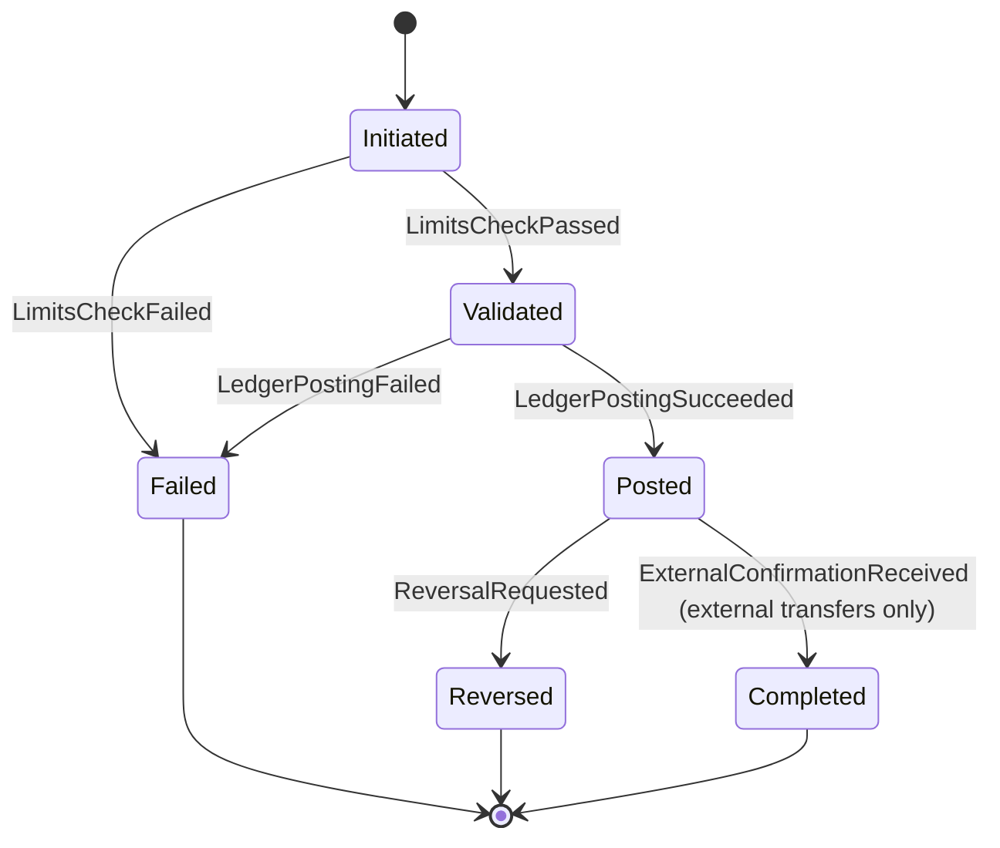
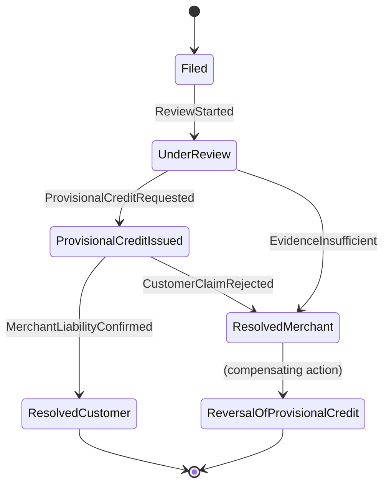

# AtlasPay — Design Reference

> Living architecture/design document. Structure only — no method bodies, no business
> logic. Update in place as the design evolves.

## Conventions

- **Java 21**, multi-module Gradle: `atlaspay-core`, `atlaspay-persistence`,
  `atlaspay-messaging`, `atlaspay-simulators`, `atlaspay-api`, `atlaspay-app`.
- `atlaspay-core` is **framework-free**: no Spring, no JPA, no Jackson annotations.
  It contains aggregates, entities, value objects, domain events, domain services,
  repository *interfaces*, and saga/process-manager skeletons.
- Package-by-feature inside `atlaspay-core` (e.g. `core.identity`, `core.accounts`,
  `core.ledger`, `core.transfers`, `core.cards`, `core.limits`, `core.access`), not
  by technical layer.
- Hexagonal architecture: `core` defines ports (interfaces); `persistence`,
  `messaging`, `simulators`, `api` are adapters plugged in at `atlaspay-app` wiring
  time (wiring itself is out of scope for this document).
- EIP references are to Hohpe & Woolf, *Enterprise Integration Patterns*. DDD
  references are to Evans, *Domain-Driven Design*.

## Shared kernel (`core.shared`)

```java
public interface DomainEvent {
    UUID eventId();          // unique event identifier
    Instant occurredOn();    // event timestamp
}
```
*Marker + minimal contract every domain event implements — supports uniform event
publishing/outbox serialization without coupling core to a messaging framework.*

```java
public interface Repository<T, ID> {
    Optional<T> findById(ID id);   // load by identity
    T save(T aggregate);           // persist new or updated aggregate state
}
```
*Generic repository port (DDD: Repository pattern). Lives in core; implementations
live in `atlaspay-persistence` — see Dependency Inversion note under each domain's
Repository section.*

```java
public sealed interface Result<T, E> permits Result.Ok, Result.Err {
    record Ok<T, E>(T value) implements Result<T, E> {}
    record Err<T, E>(E error) implements Result<T, E> {}

    boolean isOk();                     // true if this is a success result
    T orElseThrow();                    // unwrap value or throw if error
}
```
*Generic `Result<T, E>` for validation/business-rule outcomes that are expected
failures (not exceptions) — e.g. KYC rule evaluation, limit checks. Avoids
exceptions-as-control-flow for expected domain outcomes.*

```java
public record Page<T>(List<T> content, int pageNumber, int pageSize, long totalElements) {
}
```
*Generic paginated read wrapper returned by repository/query methods that list
aggregates (e.g. `findByCompanyId` paged variants).*

```java
public interface Specification<T> {
    boolean isSatisfiedBy(T candidate);         // true if candidate meets the rule
    Specification<T> and(Specification<T> other); // combinator: logical AND
    Specification<T> or(Specification<T> other);  // combinator: logical OR
}
```
*Generic Specification pattern (Evans) — backbone of the pluggable `KycRuleEngine`
and reusable for `LimitPolicy` rule composition.*

```java
public abstract class AggregateRoot<ID> {
    private final List<DomainEvent> pendingEvents; // uncommitted events raised by this aggregate

    protected void register(DomainEvent event);     // records an event to be published on save
    public List<DomainEvent> pullEvents();          // drains and returns pending events
}
```
*Base type applying the DDD Aggregate Root pattern's event-recording responsibility
uniformly; concrete aggregates extend this instead of re-implementing event buffers.*

---

## 1. Identity & Onboarding

### Aggregates & Entities

```java
public final class Company extends AggregateRoot<CompanyId> {
    private final CompanyId id;                 // identity
    private CompanyName name;                    // legal name VO
    private RegistrationNumber registrationNumber; // business registration VO
    private CompanyStatus status;                 // PENDING, VERIFIED, SUSPENDED
    private final Instant onboardedAt;

    public Company(CompanyId id, CompanyName name, RegistrationNumber registrationNumber); // enforces required fields; invariant enforcement
    public void verify(VerificationDecision decision);       // transitions PENDING -> VERIFIED; raises CompanyVerified
    public void suspend(String reason);                       // transitions -> SUSPENDED; raises CompanySuspended
    public CompanyStatus status();                            // accessor
}
```
*Aggregate Root — invariant: cannot transition to VERIFIED without a passing
`VerificationDecision`; enforced inside `verify`, not by callers.*

```java
public final class Customer extends AggregateRoot<CustomerId> {
    private final CustomerId id;                  // identity
    private final CompanyId companyId;             // owning company (aggregate reference by ID only)
    private PersonalDetails personalDetails;        // name/DOB/address VO
    private KycTier kycTier;                        // current tier
    private KycStatus kycStatus;                     // NOT_STARTED, IN_REVIEW, APPROVED, REJECTED

    public Customer(CustomerId id, CompanyId companyId, PersonalDetails personalDetails); // invariant enforcement: valid personal details required
    public void applyKycTier(KycTier newTier);           // raises CustomerKycTierChanged; invariant: tier changes only from APPROVED status
    public void recordKycDecision(KycDecision decision); // updates kycStatus; raises CustomerKycDecided
    public KycTier kycTier();                             // accessor
}
```
*Aggregate Root referencing `Company` by identity only (`CompanyId`), per DDD
aggregate boundary rules — avoids loading the whole company graph to mutate a
customer.*

```java
public final class KycCase extends AggregateRoot<KycCaseId> {
    private final KycCaseId id;
    private final CustomerId customerId;
    private final List<KycCheckResult> checkResults; // private, exposed only via unmodifiable view
    private KycStatus status;

    public KycCase(KycCaseId id, CustomerId customerId);   // invariant enforcement
    public void recordCheckResult(KycCheckResult result);   // appends result; recalculates status
    public List<KycCheckResult> checkResults();              // returns unmodifiable copy
}
```
*Entity (not independently addressable outside the KYC process) modeling the
evolving state of a KYC review — could also be modeled as its own Aggregate Root
if KYC review needs independent concurrency control; noted as an open design
question.*

### Value Objects

- `CompanyId`, `CustomerId`, `KycCaseId` — wrap `UUID`; value-equality by wrapped id.
- `CompanyName(String value)` — non-blank invariant enforced in constructor.
- `RegistrationNumber(String value)` — format-validated in constructor.
- `PersonalDetails(String fullName, LocalDate dateOfBirth, Address address)` — compared by all fields.
- `Address(String line1, String line2, String city, String postalCode, String countryCode)`.
- `KycTier` — enum `TIER_0, TIER_1, TIER_2, TIER_3` (increasing verification depth, ties to Limits domain).
- `VerificationDecision(boolean approved, String reviewer, Instant decidedAt)`.
- `KycDecision(KycStatus outcome, String reviewer, String notes)`.
- `KycCheckResult(String checkName, boolean passed, String detail)`.

*All value objects: immutable (`final` fields, no setters), `equals`/`hashCode`
over all fields, no identity field — per DDD Value Object pattern.*

### Domain Events

```java
public record CompanyVerified(UUID eventId, Instant occurredOn, CompanyId companyId) implements DomainEvent {}
public record CompanySuspended(UUID eventId, Instant occurredOn, CompanyId companyId, String reason) implements DomainEvent {}
public record CustomerKycTierChanged(UUID eventId, Instant occurredOn, CustomerId customerId, KycTier oldTier, KycTier newTier) implements DomainEvent {}
public record CustomerKycDecided(UUID eventId, Instant occurredOn, CustomerId customerId, KycStatus status) implements DomainEvent {}
```

### Repository Interfaces

```java
public interface CompanyRepository extends Repository<Company, CompanyId> {
    Optional<Company> findByRegistrationNumber(RegistrationNumber number); // lookup for onboarding dedup
}

public interface CustomerRepository extends Repository<Customer, CustomerId> {
    List<Customer> findByCompanyId(CompanyId companyId); // list customers under a company
}

public interface KycCaseRepository extends Repository<KycCase, KycCaseId> {
    Optional<KycCase> findActiveByCustomerId(CustomerId customerId); // find in-flight case
}
```
*Interfaces live in `core.identity` (Dependency Inversion — the domain defines the
contract it needs); JPA-backed implementations live in `atlaspay-persistence`, so
core never depends on JPA/Hibernate types.*

### Domain Services

```java
public interface KycRuleEngine {
    Result<KycTier, List<String>> evaluate(Customer customer, KycCase kycCase); // determines eligible tier or validation failures
}

public interface KycRule extends Specification<KycCase> {
    String ruleName(); // identifies the rule for audit/reporting
}
```
*`KycRuleEngine` composes pluggable `KycRule` specifications (Specification
pattern) so new compliance rules can be added without modifying the engine —
Open/Closed Principle applied to a domain service.*

---

## 2. Accounts

### Aggregates & Entities

```java
public final class Account extends AggregateRoot<AccountId> {
    private final AccountId id;                 // identity
    private final AccountNumber accountNumber;    // externally visible VO
    private final CustomerId ownerId;               // owning customer reference by ID
    private AccountType type;                       // WALLET, SETTLEMENT, etc.
    private AccountStatus status;                    // ACTIVE, FROZEN, CLOSED

    public Account(AccountId id, AccountNumber accountNumber, CustomerId ownerId, AccountType type); // invariant enforcement
    public void freeze(String reason);          // ACTIVE -> FROZEN; raises AccountFrozen
    public void close();                          // -> CLOSED; invariant: balance must be zero (checked via BalanceCalculator at application layer)
    public AccountStatus status();                // accessor
}
```
*Aggregate Root. Deliberately holds **no balance field** — balance is a derived
read, never stored state, to keep the ledger the single source of truth (see
Domain Services below).*

### Value Objects

- `AccountId` — wraps `UUID`.
- `AccountNumber(String value)` — fixed-format identifier, checksum-validated in constructor; compared by value.
- `AccountType` — enum `WALLET, SETTLEMENT, FEE_COLLECTION, DISPUTE_HOLDING`.
- `AccountStatus` — enum `ACTIVE, FROZEN, CLOSED`.
- `Balance(Money amount, Instant asOf)` — a **derived, transient** VO returned by queries, never persisted against `Account` itself.

### Domain Events

```java
public record AccountOpened(UUID eventId, Instant occurredOn, AccountId accountId, CustomerId ownerId) implements DomainEvent {}
public record AccountFrozen(UUID eventId, Instant occurredOn, AccountId accountId, String reason) implements DomainEvent {}
public record AccountClosed(UUID eventId, Instant occurredOn, AccountId accountId) implements DomainEvent {}
```

### Repository Interfaces

```java
public interface AccountRepository extends Repository<Account, AccountId> {
    List<Account> findByCompanyId(CompanyId companyId);   // accounts under a company (via customer join at adapter level)
    Optional<Account> findByAccountNumber(AccountNumber number); // lookup for transfers
}
```
*Kept framework-free in core; the `atlaspay-persistence` implementation performs
the actual join across `Customer`/`Company` using JPA, hidden behind this
interface — core never expresses SQL/JPQL concerns.*

### Domain Services

```java
public interface BalanceCalculator {
    Balance currentBalance(AccountId accountId);                 // sums posted ledger lines
    Balance balanceAsOf(AccountId accountId, Instant pointInTime); // historical balance query
}
```
*Stateless domain service — balance is *computed*, not stored, enforcing the
Ledger domain as sole source of financial truth (avoids dual-write inconsistency
between an `Account.balance` field and ledger entries).*

---

## 3. Ledger

### Aggregates & Entities

```java
public final class JournalEntry extends AggregateRoot<JournalEntryId> {
    private final JournalEntryId id;              // identity
    private final Instant postedAt;                  // append-only: immutable once constructed
    private final TransactionReference reference;     // correlates to originating transfer/payment
    private final List<LedgerLine> lines;               // unmodifiable, at least 2 lines

    public JournalEntry(JournalEntryId id, TransactionReference reference, List<LedgerLine> lines); // invariant enforcement: lines must balance to zero (double-entry) and list.size() >= 2
    public List<LedgerLine> lines();                    // returns unmodifiable view
    public boolean isBalanced();                          // verifies sum(debits) == sum(credits)
}
```
*Aggregate Root. **Append-only and immutable** — no setters, no mutation methods
at all after construction; the constructor is the sole invariant-enforcement
point (double-entry balance rule), consistent with the ledger being a
write-once audit trail (Evans: Aggregate invariants enforced at construction).*

### Value Objects

- `Money(BigDecimal amount, Currency currency)` — arithmetic methods (`add`, `subtract`, `negate`) return new `Money`; throws on currency mismatch; compared by value.
- `LedgerLine(AccountId accountId, Money amount, EntryDirection direction)` — `EntryDirection` enum `DEBIT, CREDIT`; immutable.
- `JournalEntryId`, `TransactionReference` — identifier VOs wrapping `UUID`/`String`.

*`LedgerLine` and `Money` are the canonical example of Value Objects here:
no identity, compared purely by field values, freely shared/copied.*

### Domain Events

```java
public record JournalEntryPosted(UUID eventId, Instant occurredOn, JournalEntryId entryId, TransactionReference reference) implements DomainEvent {}
```

### Repository Interfaces

```java
public interface JournalEntryRepository extends Repository<JournalEntry, JournalEntryId> {
    List<JournalEntry> findByAccountId(AccountId accountId);                       // all entries touching an account
    List<JournalEntry> findByAccountId(AccountId accountId, Instant from, Instant to); // windowed read, used by Limits domain
}
```
*Append-only aggregate ⇒ repository intentionally has **no delete/update-style
methods** at the interface level — the contract itself communicates the
immutability invariant to any adapter implementing it.*

### Domain Services

```java
public interface LedgerPostingService {
    JournalEntry post(TransactionReference reference, List<LedgerLine> lines); // constructs & persists a balanced JournalEntry
}
```
*Thin domain service wrapping construction + repository save, giving other
domains (Transfers, Cards) a single entry point instead of constructing
`JournalEntry` directly.*

---

## 4. Transfers

### Aggregates & Entities

```java
public sealed abstract class Transfer extends AggregateRoot<TransferId>
        permits InternalTransfer, InboundExternalTransfer, OutboundExternalTransfer {
    protected final TransferId id;             // identity
    protected final Money amount;
    protected TransferStatus status;             // INITIATED, POSTED, FAILED, REVERSED

    protected Transfer(TransferId id, Money amount); // invariant enforcement: amount must be positive
    public TransferStatus status();                    // accessor
    public abstract void markPosted(JournalEntryId entryId); // records successful ledger posting
    public abstract void markFailed(String reason);          // records failure
}

public final class InternalTransfer extends Transfer {
    private final AccountId sourceAccountId;
    private final AccountId destinationAccountId; // invariant: source != destination, enforced in constructor
    // constructor + accessors omitted for brevity — see implementation
}

public final class InboundExternalTransfer extends Transfer {
    private final AccountId destinationAccountId;
    private final ExternalPartyReference originatingParty; // e.g. simulated bank reference
}

public final class OutboundExternalTransfer extends Transfer {
    private final AccountId sourceAccountId;
    private final ExternalPartyReference beneficiaryParty;
}
```
*Aggregate Root hierarchy (sealed) modeling three distinct transfer flows as
subtypes rather than a single flags-heavy class — each subtype enforces its own
invariants (e.g. `sourceAccountId != destinationAccountId`) in its constructor.*

### Value Objects

- `TransferId` — wraps `UUID`.
- `ExternalPartyReference(String partyId, String partyName)` — identifies a simulated external counterparty; compared by value.
- `TransferStatus` — enum `INITIATED, POSTED, FAILED, REVERSED`.

### Domain Events

```java
public record TransferInitiated(UUID eventId, Instant occurredOn, TransferId transferId, Money amount) implements DomainEvent {}
public record TransferPosted(UUID eventId, Instant occurredOn, TransferId transferId, JournalEntryId entryId) implements DomainEvent {}
public record TransferFailed(UUID eventId, Instant occurredOn, TransferId transferId, String reason) implements DomainEvent {}
public record TransferReversed(UUID eventId, Instant occurredOn, TransferId transferId, JournalEntryId compensatingEntryId) implements DomainEvent {}
```

### Repository Interfaces

```java
public interface TransferRepository extends Repository<Transfer, TransferId> {
    List<Transfer> findByAccountId(AccountId accountId); // history for either side of a transfer
}
```

### Domain Services

```java
public interface TransferValidationService {
    Result<Void, List<String>> validate(Transfer transfer); // pre-posting checks (e.g. limits) before saga proceeds
}
```

### Saga / Process Manager



```java
public final class TransferSaga {
    private final TransferId transferId;   // correlation id
    private TransferSagaState state;         // current process-manager state

    public void onTransferInitiated(TransferInitiated event);            // starts saga, requests limits check
    public void onLimitsCheckResult(Result<Void, List<String>> result);   // proceeds to posting or triggers compensating failure
    public void onLedgerPostingSucceeded(JournalEntryId entryId);          // transitions to Posted
    public void onLedgerPostingFailed(String reason);                       // compensating action: mark Transfer failed
    public void onExternalConfirmationReceived(ExternalPartyReference ref);  // completes external transfer flow
    public void onReversalRequested(String reason);                          // triggers compensating ledger entry
}
```
*EIP **Process Manager** pattern: the saga centralizes routing/sequencing logic
across Limits, Ledger, and (for external transfers) Simulator interactions,
so no single aggregate needs to know about the others. Compensating actions
(`onLedgerPostingFailed`, `onReversalRequested`) implement the Saga pattern's
rollback semantics instead of distributed transactions.*

---

## 5. Cards

### Aggregates & Entities

```java
public final class Card extends AggregateRoot<CardId> {
    private final CardId id;                     // identity
    private final CardToken token;                  // tokenized PAN surrogate, never raw PAN
    private final AccountId linkedAccountId;
    private CardStatus status;                        // ISSUED, ACTIVE, BLOCKED, EXPIRED
    private final YearMonth expiry;

    public Card(CardId id, CardToken token, AccountId linkedAccountId, YearMonth expiry); // invariant enforcement: expiry must be in the future
    public void activate();                       // ISSUED -> ACTIVE; raises CardActivated
    public void block(String reason);               // -> BLOCKED; raises CardBlocked
    public CardStatus status();                       // accessor
}
```
*Aggregate Root. Never stores raw PAN — only a `CardToken` value object,
demonstrating a security invariant enforced structurally rather than by
validation logic.*

```java
public final class Dispute extends AggregateRoot<DisputeId> {
    private final DisputeId id;
    private final CardId cardId;
    private final TransferId originatingTransferId;
    private ReasonCode reasonCode;
    private DisputeStatus status;                 // FILED, UNDER_REVIEW, RESOLVED_MERCHANT, RESOLVED_CUSTOMER

    public Dispute(DisputeId id, CardId cardId, TransferId originatingTransferId, ReasonCode reasonCode); // invariant enforcement
    public void resolve(DisputeResolution resolution);  // transitions to a RESOLVED_* status; raises DisputeResolved
    public DisputeStatus status();                        // accessor
}
```
*Aggregate Root, separate from `Card`, because disputes have independent
lifecycle/concurrency needs (DDD: aggregate boundaries drawn around consistency
requirements, not just object containment).*

### Value Objects

- `CardId`, `DisputeId` — wrap `UUID`.
- `CardToken(String value)` — opaque tokenized reference; compared by value.
- `CardStatus` — enum `ISSUED, ACTIVE, BLOCKED, EXPIRED`.
- `ReasonCode(String code, String description)` — chargeback/dispute reason taxonomy entry.
- `DisputeResolution(DisputeStatus outcome, Money adjustedAmount, String notes)`.

### Domain Events

```java
public record CardIssued(UUID eventId, Instant occurredOn, CardId cardId, AccountId linkedAccountId) implements DomainEvent {}
public record CardActivated(UUID eventId, Instant occurredOn, CardId cardId) implements DomainEvent {}
public record CardBlocked(UUID eventId, Instant occurredOn, CardId cardId, String reason) implements DomainEvent {}
public record DisputeFiled(UUID eventId, Instant occurredOn, DisputeId disputeId, ReasonCode reasonCode) implements DomainEvent {}
public record DisputeResolved(UUID eventId, Instant occurredOn, DisputeId disputeId, DisputeStatus outcome) implements DomainEvent {}
```

### Repository Interfaces

```java
public interface CardRepository extends Repository<Card, CardId> {
    List<Card> findByAccountId(AccountId accountId); // cards linked to an account
}

public interface DisputeRepository extends Repository<Dispute, DisputeId> {
    List<Dispute> findByCardId(CardId cardId); // dispute history for a card
}
```

### Domain Services

```java
public interface CardPaymentAuthorizationService {
    Result<AuthorizationDecision, List<String>> authorize(Card card, Money amount); // pre-network domain-level checks (status, limits)
}
```

### Saga / Process Manager



```java
public final class ChargebackSaga {
    private final DisputeId disputeId;   // correlation id
    private ChargebackSagaState state;     // current process-manager state

    public void onDisputeFiled(DisputeFiled event);                       // starts saga, requests review
    public void onReviewStarted();                                          // transitions to UnderReview
    public void onProvisionalCreditRequested();                             // triggers ledger credit to customer account
    public void onMerchantLiabilityConfirmed();                              // finalizes in customer's favor
    public void onCustomerClaimRejected();                                    // compensating action: reverse provisional credit
    public void onEvidenceInsufficient();                                      // resolves in merchant's favor without credit
}
```
*Another EIP **Process Manager**: coordinates `Dispute` state, provisional
ledger credits, and eventual resolution across the Ledger domain, with an
explicit compensating action (`onCustomerClaimRejected` → reversal) mirroring
the Saga pattern's rollback step.*

---

## 6. Limits

### Aggregates & Entities

```java
public final class LimitPolicy extends AggregateRoot<LimitPolicyId> {
    private final LimitPolicyId id;             // identity
    private final KycTier applicableTier;          // ties policy to a KYC tier
    private final Money maxSingleTransaction;
    private final Money maxRollingWindow;
    private final Duration rollingWindowDuration;

    public LimitPolicy(LimitPolicyId id, KycTier applicableTier, Money maxSingleTransaction, Money maxRollingWindow, Duration rollingWindowDuration); // invariant enforcement: limits must be positive
    public Result<Void, String> evaluateSingleTransaction(Money amount);          // checks against maxSingleTransaction
}
```
*Aggregate Root; kept small and immutable-after-construction since limit
policies are configuration-like and versioned by replacement rather than
in-place mutation.*

### Value Objects

- `LimitPolicyId` — wraps `UUID`.
- `RollingWindowUsage(Money totalSpent, Instant windowStart, Instant windowEnd)` — derived VO, never persisted directly.

### Domain Events

```java
public record LimitPolicyCreated(UUID eventId, Instant occurredOn, LimitPolicyId policyId, KycTier applicableTier) implements DomainEvent {}
public record LimitBreached(UUID eventId, Instant occurredOn, AccountId accountId, LimitPolicyId policyId) implements DomainEvent {}
```

### Repository Interfaces

```java
public interface LimitPolicyRepository extends Repository<LimitPolicy, LimitPolicyId> {
    Optional<LimitPolicy> findByTier(KycTier tier); // active policy for a KYC tier
}
```

### Domain Services

```java
public interface RollingWindowLimitChecker {
    Result<Void, String> checkAgainstWindow(AccountId accountId, LimitPolicy policy, Money proposedAmount); // sums recent JournalEntryRepository lines within window, compares to policy
}
```
*Depends on `JournalEntryRepository`'s windowed query — Limits reads the ledger
rather than maintaining its own running totals, keeping the ledger the single
source of truth (consistent with Accounts domain's balance rule).*

---

## 7. Platform Access

### Aggregates & Entities

```java
public final class ApiKey extends AggregateRoot<ApiKeyId> {
    private final ApiKeyId id;                    // identity
    private final CompanyId ownerCompanyId;
    private final HashedSecret hashedSecret;          // never stores plaintext secret
    private final Set<Scope> scopes;                    // unmodifiable
    private ApiKeyStatus status;                          // ACTIVE, REVOKED

    public ApiKey(ApiKeyId id, CompanyId ownerCompanyId, HashedSecret hashedSecret, Set<Scope> scopes); // invariant enforcement: at least one scope required
    public void revoke();                            // ACTIVE -> REVOKED; raises ApiKeyRevoked
    public boolean hasScope(Scope scope);              // authorization check helper
}

public final class WebhookSubscription extends AggregateRoot<WebhookSubscriptionId> {
    private final WebhookSubscriptionId id;
    private final CompanyId ownerCompanyId;
    private final URI callbackUrl;
    private final Set<String> eventTypes;             // subscribed event type names
    private WebhookSubscriptionStatus status;             // ACTIVE, PAUSED, DISABLED

    public WebhookSubscription(WebhookSubscriptionId id, CompanyId ownerCompanyId, URI callbackUrl, Set<String> eventTypes); // invariant enforcement
    public void disable(String reason);      // -> DISABLED after repeated delivery failures; raises WebhookSubscriptionDisabled
}

public final class WebhookDelivery extends AggregateRoot<WebhookDeliveryId> {
    private final WebhookDeliveryId id;
    private final WebhookSubscriptionId subscriptionId;
    private final String payload;                  // serialized event payload
    private DeliveryStatus status;                    // PENDING, DELIVERED, RETRYING, DEAD_LETTERED
    private int attemptCount;

    public WebhookDelivery(WebhookDeliveryId id, WebhookSubscriptionId subscriptionId, String payload); // invariant enforcement
    public void recordAttemptFailure();          // increments attemptCount; transitions to RETRYING or DEAD_LETTERED
    public void recordDelivered();                 // -> DELIVERED
}
```
*Three related Aggregate Roots kept distinct: `ApiKey` (auth), `WebhookSubscription`
(configuration), `WebhookDelivery` (per-event delivery attempt state) — separated
because each has an independent lifecycle and consistency boundary.*

### Value Objects

- `ApiKeyId`, `WebhookSubscriptionId`, `WebhookDeliveryId` — wrap `UUID`.
- `HashedSecret(String algorithm, String hash)` — never carries plaintext; compared by value.
- `Scope` — enum, e.g. `TRANSFERS_READ, TRANSFERS_WRITE, CARDS_READ, CARDS_WRITE, WEBHOOKS_MANAGE`.
- `ApiKeyStatus`, `WebhookSubscriptionStatus`, `DeliveryStatus` — status enums.

### Domain Events

```java
public record ApiKeyIssued(UUID eventId, Instant occurredOn, ApiKeyId apiKeyId, CompanyId ownerCompanyId) implements DomainEvent {}
public record ApiKeyRevoked(UUID eventId, Instant occurredOn, ApiKeyId apiKeyId) implements DomainEvent {}
public record WebhookSubscriptionDisabled(UUID eventId, Instant occurredOn, WebhookSubscriptionId subscriptionId, String reason) implements DomainEvent {}
public record WebhookDeliveryDeadLettered(UUID eventId, Instant occurredOn, WebhookDeliveryId deliveryId) implements DomainEvent {}
```

### Repository Interfaces

```java
public interface ApiKeyRepository extends Repository<ApiKey, ApiKeyId> {
    Optional<ApiKey> findByHashedSecret(HashedSecret hashedSecret); // authentication lookup
}

public interface WebhookSubscriptionRepository extends Repository<WebhookSubscription, WebhookSubscriptionId> {
    List<WebhookSubscription> findActiveByEventType(String eventType); // fan-out targets for a published event
}

public interface WebhookDeliveryRepository extends Repository<WebhookDelivery, WebhookDeliveryId> {
    List<WebhookDelivery> findPendingRetries();                       // deliveries due for retry
    List<WebhookDelivery> findBySubscriptionId(WebhookSubscriptionId id); // delivery history/audit
}
```

### Domain Services

```java
public interface WebhookRetryPolicy {
    Duration nextBackoff(int attemptCount);        // computes delay before next retry attempt
    boolean shouldDeadLetter(int attemptCount);       // determines when to stop retrying
}
```
*EIP **Dead Letter Channel**: `shouldDeadLetter` decides when a `WebhookDelivery`
moves off the normal retry path into a dead-letter state for manual/alternate
handling, instead of retrying indefinitely.*

---

## Infrastructure Adapters

### Persistence (`atlaspay-persistence`)

JPA entities mirror core aggregates field-for-field but are **separate classes**
with **no methods** — mapping between core and JPA entity happens in adapter
mapper classes (not shown; out of scope for structure-only doc).

```java
@Entity
@Table(name = "companies")
public class CompanyJpaEntity {
    @Id
    private UUID id;
    private String name;
    private String registrationNumber;
    @Enumerated(EnumType.STRING)
    private CompanyStatus status;
    private Instant onboardedAt;
}

@Entity
@Table(name = "customers")
public class CustomerJpaEntity {
    @Id
    private UUID id;
    private UUID companyId;
    private String fullName;
    private LocalDate dateOfBirth;
    @Enumerated(EnumType.STRING)
    private KycTier kycTier;
    @Enumerated(EnumType.STRING)
    private KycStatus kycStatus;
}

@Entity
@Table(name = "accounts")
public class AccountJpaEntity {
    @Id
    private UUID id;
    private String accountNumber;
    private UUID ownerId;
    @Enumerated(EnumType.STRING)
    private AccountType type;
    @Enumerated(EnumType.STRING)
    private AccountStatus status;
}

@Entity
@Table(name = "journal_entries")
public class JournalEntryJpaEntity {
    @Id
    private UUID id;
    private String reference;
    private Instant postedAt;
    @OneToMany(cascade = CascadeType.PERSIST, orphanRemoval = false)
    private List<LedgerLineJpaEntity> lines;
}

@Entity
@Table(name = "ledger_lines")
public class LedgerLineJpaEntity {
    @Id
    private UUID id;
    private UUID accountId;
    private BigDecimal amount;
    private String currency;
    @Enumerated(EnumType.STRING)
    private EntryDirection direction;
}

@Entity
@Table(name = "cards")
public class CardJpaEntity {
    @Id
    private UUID id;
    private String cardToken;
    private UUID linkedAccountId;
    @Enumerated(EnumType.STRING)
    private CardStatus status;
    private YearMonth expiry;
}

@Entity
@Table(name = "disputes")
public class DisputeJpaEntity {
    @Id
    private UUID id;
    private UUID cardId;
    private UUID originatingTransferId;
    private String reasonCode;
    @Enumerated(EnumType.STRING)
    private DisputeStatus status;
}
```
*Clear separation between core domain classes and JPA entities is intentional
(Hexagonal architecture): the domain model never carries `@Entity`/`@Id`
annotations, so `atlaspay-core` compiles with zero JPA dependency.*

#### Outbox

```java
@Entity
@Table(name = "outbox_entries")
public class OutboxEntry {
    @Id
    private UUID id;
    private String aggregateType;
    private UUID aggregateId;
    private String eventType;
    private String payload;         // serialized DomainEvent
    private Instant occurredOn;
    @Enumerated(EnumType.STRING)
    private OutboxStatus status;    // PENDING, PUBLISHED, FAILED
}

public final class OutboxRelay {
    public void pollAndPublish();                       // reads PENDING entries, publishes to Kafka, marks PUBLISHED
    public void retryFailed();                             // re-attempts FAILED entries
}
```
*EIP **Guaranteed Delivery** / **Transactional Client**: `OutboxEntry` rows are
written in the same DB transaction as the aggregate change, and `OutboxRelay`
publishes asynchronously afterward — avoiding a distributed transaction across
the database and Kafka while guaranteeing at-least-once event delivery.*

### Messaging (`atlaspay-messaging`)

Topics (one per domain):

- `atlaspay.identity.events`
- `atlaspay.accounts.events`
- `atlaspay.ledger.events`
- `atlaspay.transfers.events`
- `atlaspay.cards.events`
- `atlaspay.limits.events`
- `atlaspay.access.events`

```java
public final class LedgerEventsConsumer {
    public void onMessage(ConsumerRecord<String, String> record); // deserializes event, delegates to handler
    private boolean alreadyProcessed(UUID eventId);                 // idempotency check against processed-events store
}
```
*EIP **Idempotent Receiver**: each consumer checks `alreadyProcessed` (backed by
a processed-event-id table) before handling, since Kafka delivery is
at-least-once and duplicate deliveries are expected.*

### Simulators (`atlaspay-simulators`)

```java
public interface BankSimulator {
    InboundTransferResult receiveInboundTransfer(ExternalPartyReference sender, Money amount, AccountNumber destination); // simulates an incoming bank credit
    OutboundTransferResult sendOutboundTransfer(AccountNumber source, ExternalPartyReference beneficiary, Money amount);   // simulates an outgoing bank debit
}

public interface CardNetworkSimulator {
    AuthorizationResult authorize(CardToken token, Money amount);          // simulates network authorization
    CaptureResult capture(AuthorizationReference authorizationRef);         // simulates capture of a prior authorization
    RefundResult refund(CaptureReference captureRef, Money amount);          // simulates a refund
    ReversalResult reverse(AuthorizationReference authorizationRef);          // simulates reversal of an unsettled authorization
}

public interface IssuingBankSimulator {
    CardIssuanceResult issueCard(AccountId linkedAccountId, YearMonth expiry); // simulates physical/virtual card issuance
    CardStatusResult reportStatus(CardToken token);                              // simulates a status inquiry from the network
}
```
*Simulator ports live in core-adjacent interfaces conceptually but their
implementations (and result DTOs like `AuthorizationResult`) live entirely in
`atlaspay-simulators`, kept separate from real external integration since
AtlasPay has none — REST-style verbs (`authorize/capture/refund/reverse`)
mirror real card-network APIs for realism.*

---

## API Layer (`atlaspay-api`)

DTOs (fields only, separate from domain models):

```java
public record CreateTransferRequest(String sourceAccountNumber, String destinationAccountNumber, BigDecimal amount, String currency) {}
public record TransferResponse(UUID transferId, String status, BigDecimal amount, String currency) {}
public record IssueCardRequest(UUID accountId, YearMonth expiry) {}
public record CardResponse(UUID cardId, String status, YearMonth expiry) {}
public record FileDisputeRequest(UUID cardId, UUID transferId, String reasonCode) {}
```

```java
@RestController
@RequestMapping("/v1/transfers")
public class TransferController {
    public ResponseEntity<TransferResponse> createTransfer(
            @RequestHeader("Idempotency-Key") String idempotencyKey,
            @RequestBody CreateTransferRequest request); // POST /v1/transfers

    public ResponseEntity<TransferResponse> getTransfer(@PathVariable UUID transferId); // GET /v1/transfers/{transferId}
}

@RestController
@RequestMapping("/v1/cards")
public class CardController {
    public ResponseEntity<CardResponse> issueCard(
            @RequestHeader("Idempotency-Key") String idempotencyKey,
            @RequestBody IssueCardRequest request); // POST /v1/cards

    public ResponseEntity<CardResponse> getCard(@PathVariable UUID cardId); // GET /v1/cards/{cardId}
    public ResponseEntity<Void> blockCard(@PathVariable UUID cardId);        // POST /v1/cards/{cardId}/block
}

@RestController
@RequestMapping("/v1/disputes")
public class DisputeController {
    public ResponseEntity<Void> fileDispute(
            @RequestHeader("Idempotency-Key") String idempotencyKey,
            @RequestBody FileDisputeRequest request); // POST /v1/disputes
}

@RestController
@RequestMapping("/v1/accounts")
public class AccountController {
    public ResponseEntity<List<AccountResponse>> listAccountsForCompany(@RequestParam UUID companyId); // GET /v1/accounts?companyId=
    public ResponseEntity<BalanceResponse> getBalance(@PathVariable UUID accountId);                     // GET /v1/accounts/{accountId}/balance
}
```
*Every state-changing endpoint (`POST`) requires an `Idempotency-Key` header —
EIP **Idempotent Receiver** applied at the HTTP boundary, complementing the
Kafka consumer-side idempotency, so retried client requests never double-post
transfers, cards, or disputes. DTOs are intentionally decoupled from domain
aggregates so API contracts can evolve independently of the domain model.*
